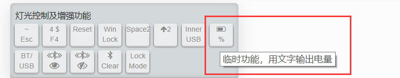
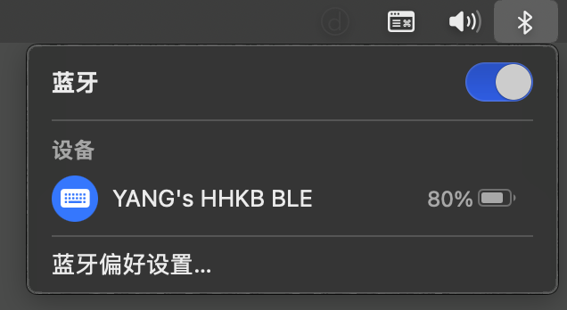
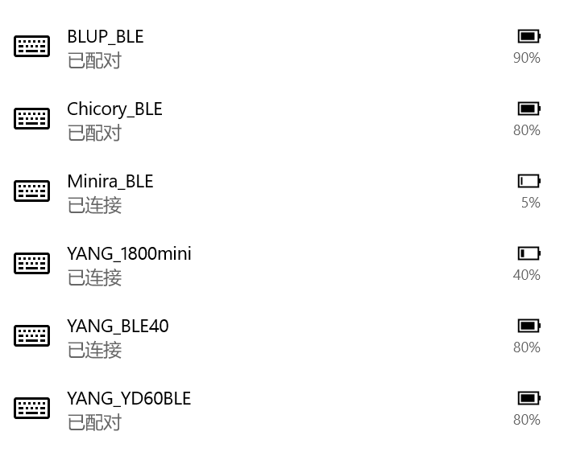
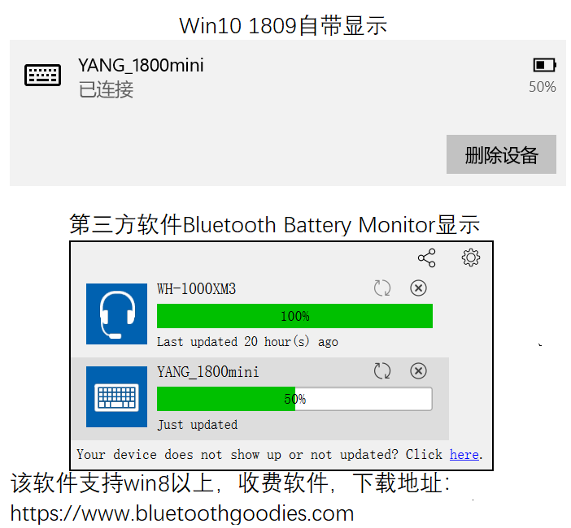
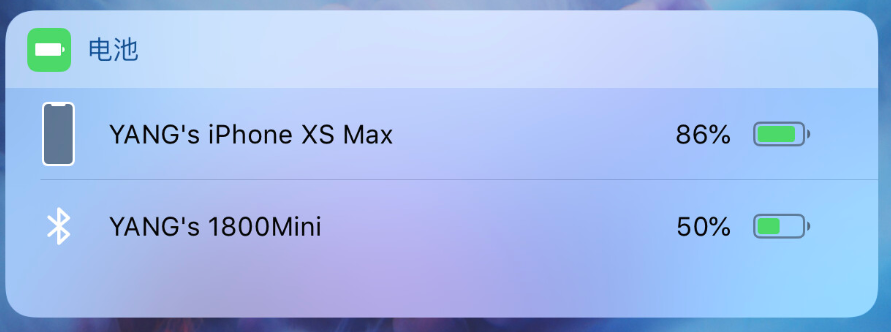
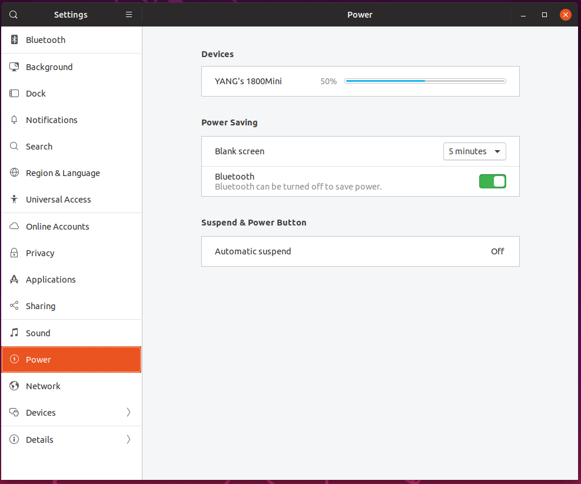

# 充电与电量提醒

一般不用经常关注剩余电量，只要在提醒低电量时，找时间充上电。或者日常偶尔插USB使用时充电。 

> [!yddh] YDKB BLE系列的最新固件均支持电量显示。但是请注意以下要点：
> - <u>电量的百分比只是根据电池电压来估算的，非精确数据</u>。计算到10%，而非1%。
> - 电量数值的非实时更新，一般是在键盘闲置一段时间时更新。
> - 部分键盘显示有 x1%(如41%，91%) 时，表示充电中。此时偏差更大，仅供参考。


## 充电注意

> [!ydda] 注意：建议使用电脑USB口或者正规的5v充电器来充电
> - 使用大功率充电器并不会提高充电速度的，默认充电电流大部分为400多ma。
> - 如果使用支持快充或非合适充电器，充电电压过高或瞬时过高，可能损坏充电IC等。
> - 充电请使用不要高于5V的充电，有的带电源的HUB上的U口或者其他的充电器，可能高于5V。

在充电过程中，特别全速充电状态（非充满或涓流状态），充电IC发热比较大，这是正常现象。

> [!yddh] 充电小知识：
> - 充电IC都具有简单的智能管理，当充满电后，会自动停止充电。
> - 停止充电后，如果继续插着线，并不会使用电池的电。
> - 如果长期插电使用，建议拔掉电池或者至少将电池开关置于关闭。

有的键盘有一个独立的充电指示灯，这个指示灯不受键盘软件控制，它的指示作用如下表：

| 充电指示灯状态 | 指示说明 |
| ---- | ---- |
| 低亮度或闪烁 | 表示电池异常（没接电池或电池有问题） |
| 较高亮度 | 表示充电中 |
| 熄灭或极低亮度 | 表示电池充满了，充满了会自动停止充电的 |

一般不用刻意去注意这个指示灯，充过一次电后就能知道大概需要充多久了。或者什么时候想起充电了就插上USB充电一下，在键盘提醒低电量的时候，充电10分钟一般也能用上一天多了，电量续航对于大部分使用场景来说是充足的。

因为电量显示为 x1% 时指示充电，所以较新的一些键盘开始取消了这个充电指示灯。

## 低电量提醒

Windows 10或11，本身在电池电量为低于5%的时候，会有系统通知提示低电量。

键盘自身，在电量电池低的时候，也会有提示。
1. 低电量模式下会禁用键盘的背光及RGB。
2. <u>在键盘处于唤醒能打字状态</u>，个别指示灯较快闪烁。若是RGB指示灯会闪红灯。
3. 在极低电量时(1%)，这个闪烁速度还会变更快。

连上USB充电会解除低电量提醒。

> [!yddh] 一些要点
> - 低电量提示开始后，一般还能再用几天。但还是建议尽快充电。
> - 有时开始低电量提示后可能会跳回不提示（电压波动），正常现象。


## 文字输出电量
这个功能适合于所有的系统，能正常打字就能输出。

在能打字的地方，用 <kbd>LShift+RShift+V</kbd> 或自己设置的按键，可以文字输出电量和连接状态。



打出的文字格式是xx-y，其中xx代表电池电量，y代表键盘蓝牙连接状态(0:未连接，1:已连接)。

文字输出电量的功能还可额外用于debug。
- 电量输出正常时，即为 x0或x1时，一般可认为键盘自身工作正常
- 输出12时代表蓝牙功能已关闭
- 输出44或45则代表通讯出错，可能需要重置蓝牙


## Mac电量显示

在最新的 <u>macOS Monterey</u>里，已经支持第三方的蓝牙设备电量显示了。macOS 12 Monterey以下的版本可以使用文字输出电量的方式查看。



## Windows 电量显示

Windows 10 或 11，最新版本都支持BLE设备的电量显示。

也可用第三方软件如Bluetooth Battery Monitor，支持win8以上，然后这个软件本身还能显示win10也不支持的其他一些无线设备的电量。

```ad-yddcol0
##### Win10自带蓝牙电量显示


```

```ad-yddcol1
##### 第三方软件显示


```

## iOS电量显示
iOS在小组件里，把电量加上后，这个小组键就会显示BLE系列的电量，如下图。  



## Ubuntu 19.04电量显示
配对好键盘后，在设置--Power　里，可以看到蓝牙键盘的电量信息，如下图。  



