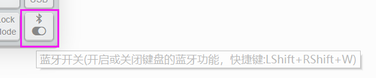

# 蓝牙开关和连接状态

这两个有一定的相关性，所以放在一起说。

注：YD60BLE v1.0当时没有加入蓝牙模块的电源控制，所以即使关闭了蓝牙功能，蓝牙依然是通电并且可以被搜索到的，只是相关功能无效。

## 部分支持物理蓝牙开关

部分比较新的键盘，硬件作了一些修改，已经取消了这个蓝牙功能的软件开关。改为靠PCB上面的硬件开关来实现蓝牙开关，那个开关在关闭电池供电的同时，也就关闭蓝牙功能。

更新到2023年之后的固件，如果蓝牙开关被关闭了，则这部分键盘输出的文字电量是120-x（而使用左右Shift+W来开关蓝牙功能的键盘是12-x）。

## 蓝牙开关

> [!ydda: 注意]
> - 大部分人一般用不上这个功能，这是给有需要长期或短期不使用蓝牙而设计的。
> - 如果日常使用想快速进入节能模式，请使用Lock Mode。

如果不支持物理蓝牙开关的键盘，那么它们的开关作用，只是电池的供电开关。即使它关了，如果插上USB线的时候，因为有外部供电，蓝牙依然还是可以工作的。

所以在最新的固件开始引入蓝牙开关，可以选择完全关闭键盘的蓝牙功能。（该设置断电后也会保存）

可以自己设置一个按键来开关蓝牙，如下图。也可以使用快捷键 <key>LShift+RShift+W</key> 来切换。

为了防止误按此快捷命令关闭蓝牙功能，以下是最新的改动，在2020年4月18日后的固件都有采用：
  - 仅按开关蓝牙或者 <kbd>LShift+RShift+W</kbd>，始终都是打开蓝牙功能
  - 在按开关蓝牙或者 <kbd>LShift+RShift+W</kbd> 同时，<kbd>LCtrl</kbd> 是按住的时候，才关闭蓝牙功能。

在关闭蓝牙后，整个键盘的蓝牙部分都不再工作，此时也建议关闭电池开关。

如何判断蓝牙是关闭的，有以下多个方法可以：
  - 每次插线时或开关电源时，不再有连接状态的提示灯了。
  - 有线使用键盘时，<kbd>LShift+RShift+S</kbd> 也不会显示蓝牙连接状态指示。
  - 用文字输出电量功能，电量输出是12，永远不会再更新。

因为蓝牙部分不工作了，所以在关闭蓝牙的时候，如果不插线，是没法再用上面的方法重新打开蓝牙的。要重新打开蓝牙的方式有：
  - 插上USB线，然后用上面的方法再切换一次蓝牙开关。
  - 参考从Lock Mode唤醒的方法（同时按 <kbd>F</kbd> 和 <kbd>J</kbd>），可以在不插线的情况下，重新打开蓝牙。

以上，方法1适合所有的BLE系列键盘，方法2部分键盘不适用。

## 蓝牙连接状态

只有上面提到的蓝牙开关开启时，才会显示蓝牙连接状态。

会在每次启动时以及其他电源状态变动时自动显示蓝牙连接状态，从二级节能唤醒时也会显一下蓝牙连接状态。

从这个指示灯也可以确认键盘是否正常启动了，以及正常唤醒了。

不同的键盘提示LED灯有所不同。不过都有一个总的规律。

> [!yddh: 蓝牙连接状态指示灯总规律]
> - 未连接时led灯较快闪，它亮和灭两种状态的时间间隔差不多。如果有RGB灯，部分RGB灯也会较快闪蓝色。
> - 连续成功后闪的较慢闪几次，而且亮起的时间比灭的时间更长。如果有RGB灯，部分RGB灯也会较慢闪绿色。

在使用键盘的过程中，也可以使用 <key>LShift+RShift+S</key>，手动查看蓝牙连接状态。

因为指示灯有限的原因，所以蓝牙连接状态的提示有的键盘会与低电量提示有重叠。优先提示低电量，只有在非低电量的时候，才会显示蓝牙连接状态。

已支持此功能的BLE系列键盘，见下表：

| 键盘??30% | 提醒方式 |
| --- | ---- |
| 1800mini | 未连接时四个指示灯快闪蓝色，已连接时四个指示灯较慢闪绿色 |
| Master98 | 未连接时四个指示灯快闪蓝色，已连接时四个指示灯较慢闪绿色 |
| Sairo64 | 未连接时Caps的轴灯快闪蓝色，已连接时Caps的轴灯较慢闪绿色 |
| X-8086K | 未连接时方向键上方灯条快闪蓝色，已连接时方向键上方灯条较慢闪绿色 |
| BLE40 / BLUP | 未连接时A键左边的键轴灯快闪蓝色，已连接时它较慢闪绿色 |
| CAD66 | 未连接时正面RGB灯条快闪蓝色，已连接时正面RGB灯条较慢闪绿色 |
| Chicory| 未连接时Caps灯快闪，已连接时Caps灯较慢闪 |
| Duang60 / Minira v2 | 未连接时Caps灯快闪以及RGB四灯闪蓝色，已连接时Caps灯较慢闪以及RGB四灯闪绿色 |
| Just 60/66/660/68| 未连接时Caps灯快闪以及RGB灯闪蓝色，已连接时Caps灯较慢闪以及RGB灯闪绿色 |
| Louise | 未连接时LED3快闪，已连接时LED2和LED3较慢闪 |
| Minira | 未连接时Caps灯（Caps按键左边的灯）快闪，已连接时Caps灯较慢闪 |
| Pearly| 未连接时LED2快闪，已连接时LED1和LED2较慢闪 |
| Xikii i6x/i8x/i104 | 未连接时LED3快闪及RGB灯闪蓝色，已连接时LED3灯较慢闪及RGB灯闪绿色 |
| YD67BLE | 未连接时指示灯（Caps与A之间）快闪，已连接时指示灯较慢闪 |
| YDP50| 未连接时Caps灯快闪，已连接时Caps灯较慢闪 |
| YDPM40BLE| 未连接时Caps灯快闪，已连接时Caps灯较慢闪 |
| HHKB BLE | 未连接时LED3快闪(默认绿灯)，已连接时LED2和LED3较慢闪 |
| BLE660C | 未连接时Caps灯和Insert灯快闪，已连接时Caps灯和Insert灯较慢闪 |
| BLE980C | 未连接时Scroll灯快闪，已连接时Scroll灯和Caps灯较慢闪 |
