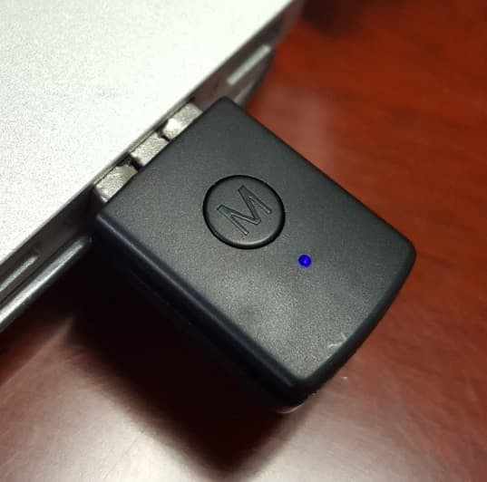

# Niz蓝牙4.0键盘接收器

经过测试，YDKB BLE系列的键盘可以使用Niz的接收器进行配对连接。

该接收器可在以下淘宝店买到： 
https://item.taobao.com/item.htm?id=576008491433 
https://item.taobao.com/item.htm?id=526210864762

可以理解为它是一个蓝牙4.0转USB-HID的设备，所以只要支持USB键盘的系统和设备，就都可以使用这个接收器。

## Niz接收器特点
Niz接收器的特点：（引用该淘宝店主的说明）
  1. 不需要安装驱动，即插即用！只要是支持USB-HID协议的系统都可以使用（普通USB有线键盘采用USB-HID协议）
  2. 支持Win XP Win7 Win8 Win10 Linux Mac Android等操作系统
  3. 支持BIOS的识别及进入操作
  4. 支持Type-C接口的转接线（如可以通过USB/Type-C转接线和支持真Type-C接口的手机实现无线连接）
  5. 专用蓝牙适配器仅适用于本品牌的无线蓝牙键盘

然后是我的补充：
  1. 针对第3点，可能不是所有的主板都支持，该接收器本身需要5秒左右的启动和连接蓝牙键盘的时间。有的主板启动太快的话，可能就无法使用此接收器进bios了。
  2. 针对第5点，应该是只要使用简单配对的蓝牙4.0键盘，这个接收器都是支持的，所以YDKB BLE系列的键盘可以使用它。

## 配对绑定方法

对于YDKB BLE的设备，绑定方法如下：
  1. 把适配器插入电脑USB口，长按适配器M小圆键3秒后再松开（清除适配器中原有的配对信息），该适配器在配对信息为空的状态下会自动搜索（适配器内LED灯快闪）最近的可连接的键盘
  2. 确定YDKB BLE系列的键盘蓝牙没有连接上其他的设备，并且处于可发现，这时它们就会自动完成配对。

## Niz接收器不足

最后再补充一点使用这个接收器的不足：
  1. 只支持常规的按键，像多媒体键（比如音量控制，启动计算器，媒体控制等，均不支持），还有鼠标功能也不支持
  2. 重新连接后初次响应速度较慢。比如接收器不动，把键盘重启，键盘指示灯已经指示连接了，但是还要等数秒按键才可用。接收器拔了重插，也是要等这么久。

## 使用建议

如果说系统本身对BLE支持就比较好，还是建议直接配对使用，现在多数的电脑都自带蓝牙了。

如果对多媒体按键不是特别需要的，然后系统比较特殊没有蓝牙驱动的，还有想把键盘接在kvm上使用的，可以考虑使用这个接收器。

还有想尝试一下这种使用方式的，也可以自己买个试试。