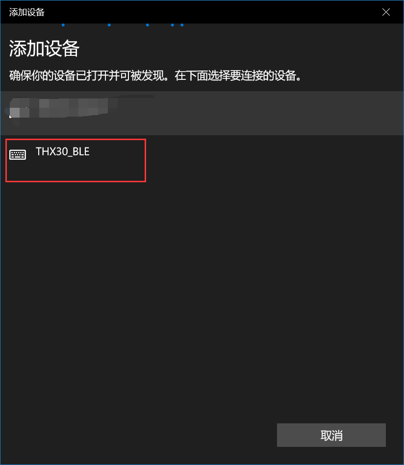
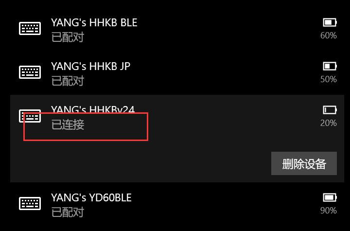
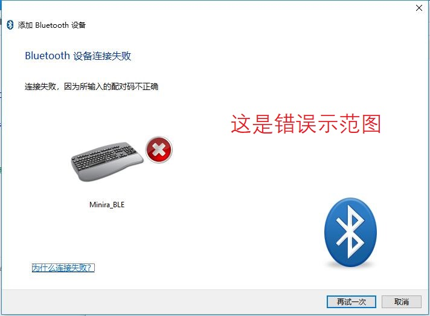
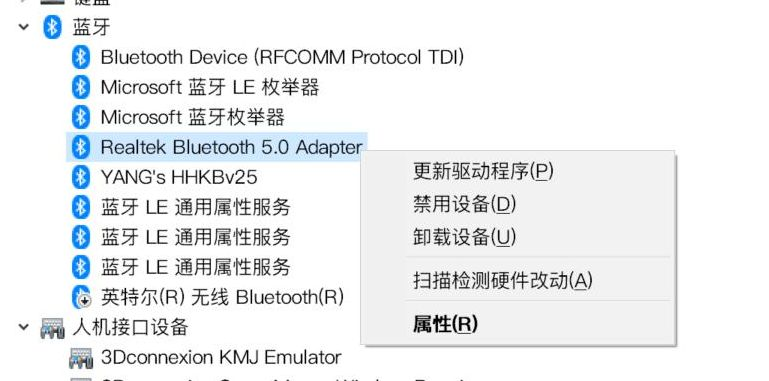

# Windows 10 / 11蓝牙配对

> [!ydda] 注意
> - 部分用户的Win10 1903在开机时无法自动连接蓝牙键盘，请升级到win10 1909或更新的版本。
> - 有的系统首次配对后，能用，但关闭再重开蓝牙，虽然显示已连接却无法使用。删除再重新配对即可。
> - 上一条的补充，在重置蓝牙后的首次连接，也可能出现。一样删除再重新配对。
> - 如果电脑上重新换了一个蓝牙接收器，也可能需要配对后删除再重新配对一次。

本文针对Windows 10 (Windows 11类似)，如果是Win7，请看[ Win7 配对 BLE 设备](ble-series/pairing-win7.md)。 

## 正常配对步骤

在键盘蓝牙未连接任何的设备，且未关闭蓝牙可发现时，蓝牙就处于可搜索并连接状态。

此时，电脑搜到键盘蓝牙后，点击它，即可配对连接上。同时再注意一下本篇开始提到的问题，有的可能要删除重新配对一次，才会一切正常。

win10自带的蓝牙搜索和连接界面是如下图的Modern UI风格(暗色或亮色主题)。在这个界面的时候直接点击设备就能连接上，不会像非正常情况那样安装了不支持的驱动导致提示需要PIN码。

再补充一点，一些初次使用蓝牙键盘的可能引起来的误会。

在Windows上只有显示为 `已连接` 时，才是连接上的，这时键盘正常时才可用。

显示为 `已配对` 时，仅代表这个电脑配对过这个设备，并没有连接上，这时键盘是不可用的。

Win11目前蓝牙配对和显示风格与Win10略有区别，但整体大致相同。

## 非正常情况

有的win10用户安装了蓝牙厂商提供的驱动，在配对的时候，出现了要求输入PIN码并且配对不成功，这也是因为那个驱动不支持蓝牙4.0的原因。如下图。

这种情况下，需要卸载Win10的多余的蓝牙驱动，让驱动恢复到Win10支持的驱动，即蓝牙搜索界面为正常配对步骤里面的那种。

## 针对注意事项的补充

如果重新配对一次，也无法解决问题。表现为需要每次删除重新配对才能使用键盘，否则只是显示已连接但键盘不可用。那么尝试如下操作。

1. 删除电脑上配对的键盘。
2. 参考 [重置蓝牙配置](ble-series/reset-ble.md)，重置键盘蓝牙。（一般软件重置即可）
3. 重新在电脑上配对蓝牙，此时能正常使用后。删除一次蓝牙，再重新配对一次。
4. 这时正常使用了，就可以再试一下将电脑蓝牙关闭再打开。待键盘重新连接后，键盘正常使用则说明连接无任何问题了。

## 如果遇到其他问题

如果遇到问题，参考 [BLE系列排错指南](ble-series/troubleshooting.md)。

## Windows下实测可推荐使用的蓝牙硬件

以下是我默认连续在日常状态下使用过多日的。我的环境是电脑wifi和手机wifi这些都主要用5GHz频段。下面使用测试是一般为连着蓝牙音箱播放音乐，同时使用蓝牙键盘。

### Intel的无线网卡自带的蓝牙

我使用过的包括Intel 8260AC，9650AC，AX200，AX210。

如果电脑本身有无线网卡，一般是Intel的，然后它自带了蓝牙。这个蓝牙已经比较好用了，需要注意的就是模块的天线一定要接上，并且放在合适的位置，以取得最佳信号。这个天线不仅是wifi的天线，同时也是蓝牙的天线。

Intel的蓝牙如果使用过程中，特别是系统升级后，遇到不流畅的问题时，建议查看Intel的官网是否有新的蓝牙驱动更新，如果有可以放心更新，一般无问题（有问题就回滚驱动）。官网地址如下：

https://www.intel.cn/content/www/cn/zh/support/articles/000005489/wireless.html

### 2 CSR8510芯片的USB蓝牙接收器

我使用的是Orico的一款，型号是BTA-409。这个芯片虽然是蓝牙4.0的，但是兼容性绝佳，能够长期使用稳定。直接使用Windows默认的驱动，不要使用卖家提供的驱动光盘里的。

USB的蓝牙接收器只要芯片相同，天线设计不要太烂，一般区别不大。

### 3 Realtek RTL8761B 蓝牙5.0芯片的USB接收器

我使用的是绿联的一款，型号是CM390。在Win10和Win11上均能自动安装好驱动。这一款早期使用时有些小bug，但在此时(2022年12月09日)，使用一切正常，没有遇到问题。

> [!ydda] 特别注意
> - 暂时不要购买5.3的蓝牙接收器，使用矩芯的ATS2851芯片，比如绿联CM591。
> - 可以参看链接: https://www.reddit.com/r/pchelp/comments/xdlmg4/ugreen_bluetooth_53_cm591_chip_ats2851/ 
> - 目前此芯片虽然蓝牙版本新，但是驱动不完善。可能会有断开蓝牙后，无法自动连接的问题。

### 4 补充: Windows下只能使用一个蓝牙硬件

补充说明，在Windows下是不支持同时使用多个蓝牙硬件的，Windows自带的蓝牙管理只能使用一个。

如果你本身有内置蓝牙，但要使用USB蓝牙，那么就需要先禁用内置的蓝牙，再插上USB蓝牙适配器。两个USB蓝牙接收器同时插着时要正确使用，也是同理，需要禁用其中一个。

蓝牙硬件在设备管理器里的蓝牙里，这时同时显示了配对过的蓝牙设备还有蓝牙服务。在右键的属性里，有高级一项，里面显示有蓝牙名称和mac地址等，这个设备就是电脑的蓝牙硬件。要禁用它，需要电脑上蓝牙处于关闭，或者蓝牙打开但是没有任何设备连接。

另外，在intel蓝牙硬件时配对的设备，如果intel蓝牙禁用了，系统还保留着它的配对信息。这时换用realtek的蓝牙，是无法正常使用的，并且这时也无法正常删除它。所以更换蓝牙硬件时的正确做法是，先删除这个设备，再更换蓝牙接收器后，重新配对这个设备。