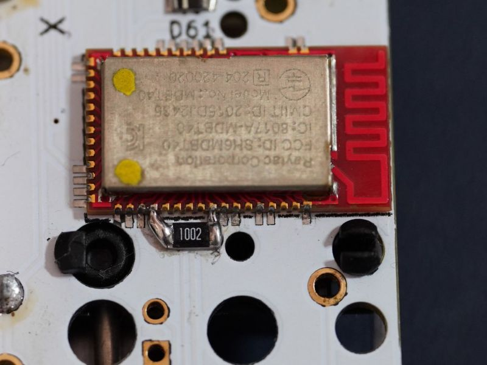
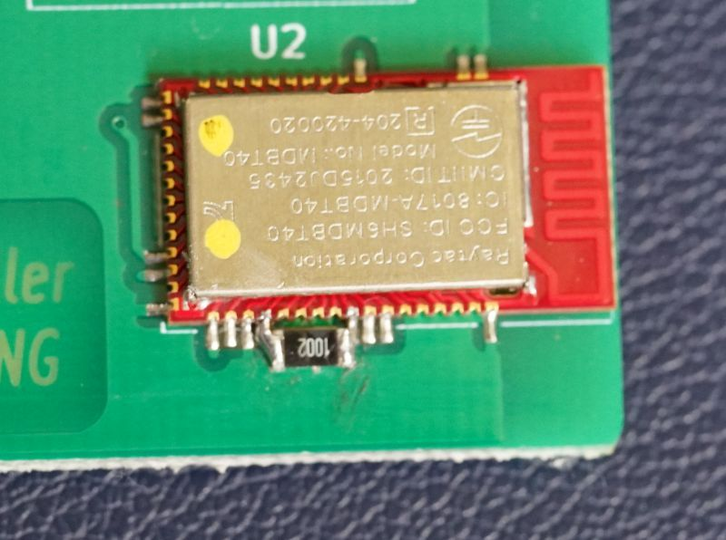

# 重置蓝牙配置

重置蓝牙，是将蓝牙的配置重置到默认，然后再由键盘固件对其进行初始化设置。蓝牙能够正确的重置并且能重新初始化，一般可以认为蓝牙硬件一切正常。

## 什么情况下需要重置

从 [BLE系列排错指南](ble-series/troubleshooting) 按照步骤排错时，可知道什么情况下需要重置。

简单概括: 文字输出电量为44或45时，需要重置蓝牙。或者连接异常其他方法都无法解决时。

> [!yddh] 建议
> - 蓝牙配置出错的情况并不多，一旦出错可以回想一下最近的操作是什么。
> - 如果有办法能稳定的复现出错的情况，请联系我。那就有办法在固件中去改进。


## 按键命令重置法

请先更新固件，是2023年之后的更好。 使用增强功能里面的<kbd>Reset</kbd>，如果未设置它，需要先把它设置到键盘上。

> [!ydda] 注意
> - 如果使用VIA或Vial的固件，这里需要设置使用的按键是 `USER` 里的 <kbd>BLERST</kbd>。


再确认一下当前电量输出不是12-0或120-0，即确认蓝牙功能没有关闭。

电脑上有配对着这个键盘，就将其删除。删除是为了之后能够搜索得到此键盘，然后观察蓝牙名称。

然后使用按键<kbd>LAlt+LWin+Reset</kbd> 或者 <kbd>LOpt+LCmd+Reset</kbd> ，执行重置蓝牙。 这时键盘会重启。

1. 蓝牙名先变回 Adafruit Bluefruit LE，若这时没自动重启，用 <kbd>LShift+RShift+B</kbd>手动重启键盘。
2. 接着它会再初始化为键盘名，等这个过程完成后，重置成功。
3. 最后，用 <kbd>LShift+RShift+V</kbd> 看<u>文字输出电量，不是44或45，确认重置成功。</u>

> [!yddh] 提醒
> - 需要按的修饰键必须都是左边的。右边的不会触发重置。
> - 一般<kbd>Reset</kbd>也不会设置在 Layer 0，所以，实际的操作就可能按下不止3个实体按键。

如果是键盘支持硬件重置(未在不支持列表里的)，这个方法都无法重置成功，则可能是硬件问题。

如果是不支持硬件重置，那么还可以使用下面的 `线路短接重置法` 试试。

> [!yddl] 默认不支持硬件重置的键盘(多数为2020年之前出的)
> - 1800mini
> - Master98 Pro
> - Sairo64
> - X-8086K
> - BLE40
> - BLUP
> - CAD66
> - Chicory
> - Fmini
> - Just60
> - Just68
> - Just66 v1.2/1.4
> - Just660
> - Just68 v1
> - Minira v1
> - YD60BLE
> - YDP50
> - YDPM40BLE 1.0
> - HHKB_BLEv2.3/4
> - BLE660C v1/2.0
> - BLE980C v2.0
> - BLE980M

> [!yddl] 有几个，在较新的硬件版本里支持了硬件重置
> - Just66 v1.6
> - HHKB BLE v2.5
> - BLE660C v2.2
> - BLE980C v2.2

## 线路短接重置法

> [!yddh] 提醒
> - 只要蓝牙模块通电正常（哪怕有其他硬件问题），短接重置法至少能将它的名称恢复到默认。
> - 如果始终不能短接重置成功，一是确认蓝牙功能没有被关闭；二是更换短接工具，有的导线，表面有绝缘漆，并不导电，或者太碰到旁边的脚。

这个需要拆开键盘，然后用导线或镊子短接蓝牙模块上的针脚。

### 1 关闭键盘电源开关

全程不再使用电池供电，能拔掉电池更好。保证只有USB插上键盘的时候有供电。

### 2 删除之前的配对

电脑上有配对着这个键盘，就将其删除。删除是为了之后能够搜索得到此键盘，然后观察蓝牙名称。

### 3 短接蓝牙模块Reset

要短接的是Factory Reset对应的脚和GND，保持住它们短接的同时，插入USB线，几秒后，这时从蓝牙搜索里看蓝牙名称应该变回Adafruit Bluefruit LE了，说明蓝牙已经恢复默认了，此时不用再保持短接了。再拔掉USB线，重新插上，名称会变回键盘蓝牙的默认名。重置完成。


补充1：有部分键盘在蓝牙模块旁边留了两个孔，并且有文字标注了 <b><u>BLE Reset</u></b> 的，也可以直接短接那两个孔。注意不是 <b><u>Reset</u></b>。

还有少部分键盘，开关不止一个，本身直接靠开关也能实现蓝牙硬件重置的短接。

| 键盘??30% | 利用开关重置蓝牙的方法 |
| --- | --- |
| Just660 | 背面的DIP开关，3和4同时打开，等同于硬件重置的短接 |
| BLE980M | 背面的DIP开关，3和4同时打开，等同于硬件重置的短接 |

### 4 再重启一次键盘

在重置完全后，建议再拔掉一次线，重新插上线，然后再连接蓝牙。


## 旧型号的硬件重置补丁

即使默认不支持按键命令硬件重置的键盘，增加一个补丁，也可以支持。在蓝牙模块的这两个脚之间加上一个10K的电阻，图片上的电阻尺寸是1206的。

```ad-yddcol0
##### 下图是最早的YD60BLE


```

```ad-yddcol1
##### 下图是HHKB BLE v2.4的


```

> [!ydda] 注意
> - 这个补丁并不是一个非必要操作，没有它也不会影响使用。
> - 焊接这个电阻是个较细致工作，比焊轴难度高很多。没焊好还把模块上旁边的脚焊上了就得不偿失。
> - 旧型号有返修时，可以要求店家帮你加上这个。

