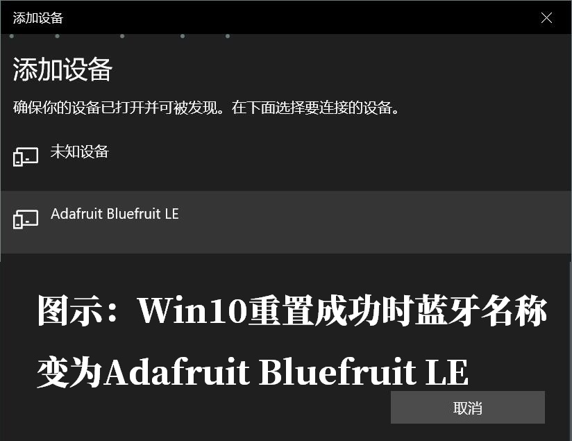
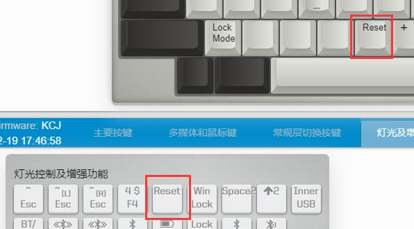
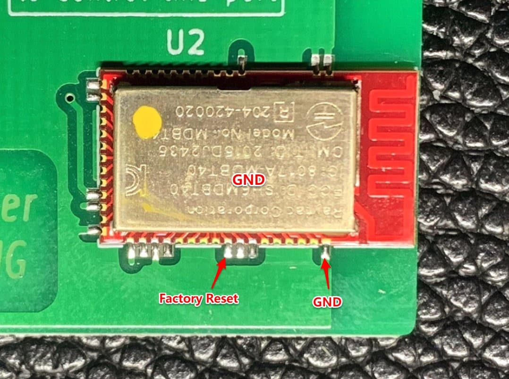
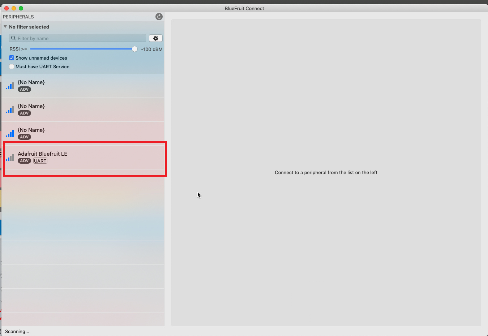
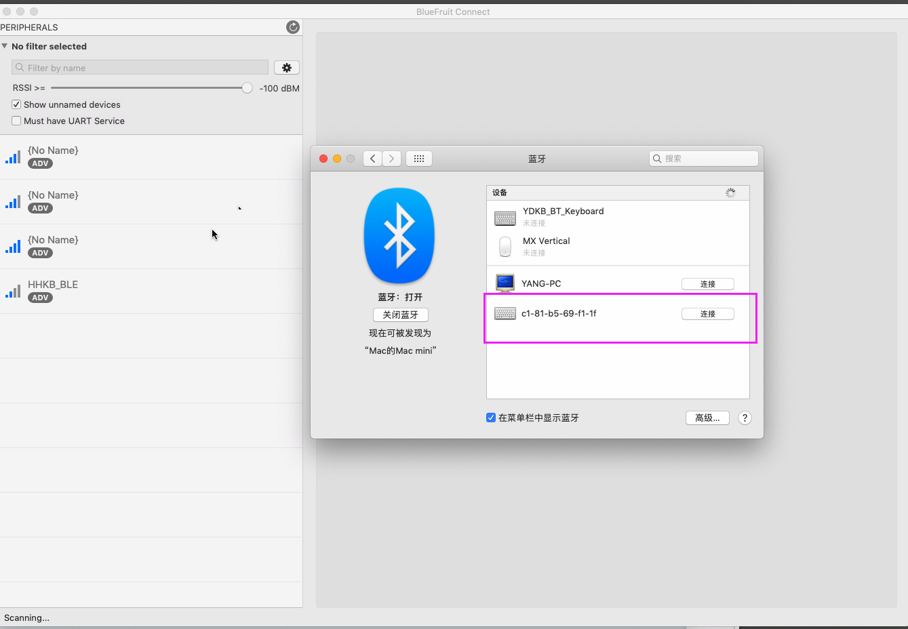

# 重置蓝牙配置

使用清除键盘端配对解决不了问题时，可以考虑使用本篇所说的**重置蓝牙**。分为软件重置和硬件重置。

> [!yddh: 提醒]
> - 重置成功后，即名称有重新初始化，建议重启一次键盘再配对连接。
> - 有时重置后第一次配对能用，但键盘重启显示已连接却无法使用。请重新配对一次。

## 什么情况下需要重置

从 [BLE系列排错指南](ble-series/troubleshooting) 按照步骤排错时，可知道什么情况下需要重置。

此处再简单说一下比较典型的出错和判断需要重置的方法。

| 现象??30% | 原因 |
| --- | --- |
| 仅连接USB使用时， 部分按键没有响应。 | 只要蓝牙功能未关闭，即使在只使用USB时，MCU与蓝牙模块之间也是一直保持通讯的（需要检查电量，连接状态等）。 MCU没有得到蓝牙模块及时的回复，就会有一个最长100ms的等待，而在这个100ms内按下的按键，就会不响应。 |
| 文字输出电量时结果为44或45 | 44或45代表没有获取到正确的返回值。 这说明蓝牙的部分配置不正常，或者MCU与蓝牙模块通讯不成功。 |

> [!yddh: 提醒]
> - 蓝牙配置出错的情况并不多，一旦出错可以回想一下最近的操作是什么。
> - 如果有办法能稳定的复现出错的情况，请联系我。那就有办法在固件中去改进。

## 软件重置与硬件重置

如果只是部分配置出错，键盘连无线时还能部分使用，只是有可能有丢键。那么这可能只是电量服务出错了，可以尝试软件重置。

如果文字输出电量是44或45，并且无法搜索到无线或者无线连接上时也不可用，那么使用硬件重置。

硬件重置一般需要拆开键盘，短接模块操作。硬件重置属于蓝牙模块自身的功能，只要它通电正常，短接就能重置。

如果临时无法拆机，可以先使用 [蓝牙开关和连接状态](ble-series/connection-status) 中的蓝牙开关，将蓝牙关闭，这样保证在USB连线时先正常使用着。**但是，要记得在之后操作重置蓝牙的时候，一定要重新打开蓝牙功能。**

> [!ydda: 注意]
> - 无论是软件还是硬件重置，确认<b>重置成功</b>的方法是同，看蓝牙名称是否<b>恢复了Adafruit Bluefruit LE</b>。
> - 之后键盘重启，这个名称如果正确配置成蓝牙键盘的默认名称，那么蓝牙硬件这块，应该无问题。
> - 太快重启了键盘可能就没看到名称恢复默认，不过键盘功能恢复正常了也能说明重置成功。

## 软件重置方法
使用增强功能里面的<kbd>Reset</kbd>，如果未设置它，需要先把它设置到键盘上。

然后使用按键<kbd>LAlt+LWin+Reset</kbd> 或者 <kbd>LOpt+LCmd+Reset</kbd> ，执行重置蓝牙。

如果执行成功，蓝牙名称会变为Adafruit Bluefruit LE，这时再重启键盘就行了（比如拔掉USB重新插，或者现时按 **左右Shift+B**）。

> [!yddh: 提醒]
> - 需要按的修饰键必须都是左边的。右边的不会触发重置。
> - 一般<kbd>Reset</kbd>也不会设置在 Layer 0，所以，实际的操作就可能按下不止3个实体按键。

## 部分特殊说明

比较新的键盘，硬件作了一些修改，所以它的软件重置实际执行的就是硬件重置。

所以在固件正常的情况下，不需要去手动短接蓝牙模块。并且在键盘在执行重置操作时有对应灯作为指示。

| 支持的键盘??30% | 重置时的指示灯 |
| --- | --- | 
| Duang60 v1/v2 Minira v2 | Caps指示灯（Caps轴左边的灯）常亮约5秒 |
| Pearly | 右下角LED1和LED2常亮约5秒，注：第3个是充电指示灯 |
| HHKB BLE v2.5 (蓝色PCB和充电指示灯) | LED1和LED3常亮约5秒 |
| BLE660C/BLE980C v2.2 (蓝色PCB和充电指示灯) | 所有指示灯常亮约5秒 |
| YD67BLE | Caps指示灯常亮约5秒 |
| Just68v2 | Caps指示灯常亮约5秒 |
| Louise | 指示灯常亮约5秒 |
| Xikii i6x/i104 | 指示灯常亮约5秒 |

还有少部分键盘，开关不止一个，本身直接靠开关也能实现蓝牙硬件重置的短接。

| 键盘??30% | 利用开关重置蓝牙的方法 |
| --- | --- | 
| Just660 | 背面的DIP开关，3和4同时打开，等同于硬件重置的短接 |
| BLE980M | 背面的DIP开关，3和4同时打开，等同于硬件重置的短接 |

## 硬件重置方法

> [!yddh: 提醒]
> - 只要蓝牙模块通电还是正常的（哪怕键盘固件不正常），硬件重置方法都是有效。</li>
> - 如果始终不能重置成功，一是确认蓝牙功能没有被关闭；二是更换短接工具，有的用的短接的导线，可能因为表面有绝缘漆，并不导电，或者太粗了碰到旁边的脚了。

这个需要拆开键盘，然后用线或镊子短接蓝牙模块上的针脚。软件重置方法只有在键盘固件和蓝牙固件都正常的情况下，才有效。当它们本身配置不正常了，重置不了的时候，就尝试使用硬件重置的方法。

### 1 关闭键盘电源开关
全程不再使用电池供电，能拔掉电池更好（这个不是必要操作）。这样是为了保证只有USB插上键盘的时候有供电，USB拔掉就无供电了。

### 2 删除之前的配对
电脑上有配对着这个键盘，就将其删除。删除是为了之后能够搜索得到此键盘，然后观察蓝牙名称。

### 3 短接蓝牙模块Reset
要短接的是Factory Reset对应的脚和GND，保持住它们短接的同时，插入USB线，几秒后，这时从蓝牙搜索里看蓝牙名称应该变回Adafruit Bluefruit LE了，说明蓝牙已经恢复默认了，此时不用再保持短接了。再拔掉USB线，重新插上，名称会变回键盘蓝牙的默认名。重置完成。

补充：有部分键盘在蓝牙模块旁边留了两个孔，并且有文字标注了**BLE Reset**的，也可以直接短接那两个孔。

### 4 再重启一次键盘
在重置完全后，建议再拔掉一次线，重新插上线，然后再连接蓝牙。

## 观察重置过程
重置的方法上面已经说完了，足够的简单了。下面的说明只是为了更好的看到重置的过程。可以不看。

重置前，删除已配对的蓝牙，这样蓝牙才能被再搜索到。

需要一个可以可以正常搜索到蓝牙并且反应比较快的设备，比如Mac下使用Adafruit Bluefruit LE Connect这个软件。在执行上面的重置操作后，可以看到蓝牙的名称已经变了。Win10用自带的搜索就行。

然后重启一下键盘（比如拔掉USB重新插，或者现时按 **左右Shift+B**），蓝牙会重新开始配置，中途会看到一个变化，蓝牙变成初始名称，但是这里有一个UART标志。

蓝牙配置完成后键盘会自动重启一次，Mac下听不到新硬件的声音，但是那个UART标志会消失，同时在系统的蓝牙里也能看到键盘了，只是显示的是蓝牙的地址，不是名称。

Windows的话就更简单了，直接打开自带的搜索蓝牙的界面。全程会显示蓝牙名称的变化。都不用发图了。
