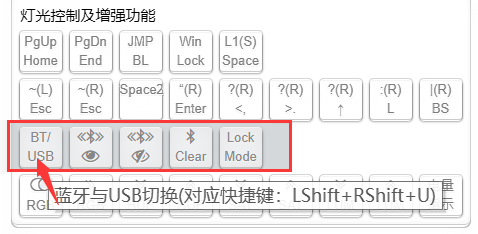
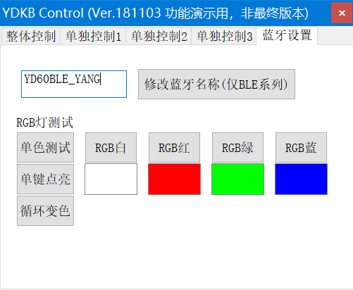

# 蓝牙的设置与使用

前面已经讲了配对，再说说对于蓝牙功能的一些使用，主要的蓝牙功能设置按键，在 **灯光及增强功能** 里。如下图这一行，鼠标指向时会有功能说明。把要需要的按键设置到键盘上就行，有的功能本身有默认快捷键，不设置也可以使用。

从左到右依次为，还有一些这里可能没列出的，另作说明。
  1. 蓝牙/USB切换
  2. 设置蓝牙可发现
  3. 设置蓝牙不可发现
  4. 清除键盘端所有已配对设备
  5. Lock Mode(锁定模式)  （部分键盘还未更新此功能）

## 蓝牙/USB切换

快捷键 **左右Shift+U**

USB和蓝牙是可以连接到不同的电脑上的，键盘在USB线未插入的情况下，是一直处在蓝牙模式的。键盘在插入USB的时候，会自动切换到USB模式。在键盘插着USB线的时候，可以在蓝牙与USB间切换，可以自己设置一个按键，或者使用左右Shift+U。

另外补充一下，不支持在多个已配对蓝牙设备间切换。  
如果配对了多个蓝牙设备，要切换从A切换到B，假设当前连接着A，需要关闭A的蓝牙，打开B的蓝牙。这个是受限于该模块自身的固件不支持主动切换。如果模块本身固件更新了，或者其他解决方法合适了，未来会加入蓝牙设备间的切换。

## 蓝牙名称修改

YDKB的大部分BLE键盘蓝牙名称都是可以自己修改的。用YDKB Tool（可以[点此下载](http://ydkb.io/YDKBs-reflash.zip)，暂仅支持windows）。然后要点是三个：
  1. 在第一页选择好自己的键盘
  2. 插上USB数据线，只有USB模式下支持修改名称
  3. 尽量不要开启按键测试软件
然后在最后一页蓝牙设置里，输出自己要修改的名称，再点击 **修改蓝牙名称** 按键。不要嫌弃这个界面丑，暂时用用，有比没有强。  

之后也会有弹出窗口提示，根据提示，删除电脑上已经配对的该键盘，然后重新搜索并配对，就是显示修改过的名称了。

如果配对在Mac上的，只需要重启一下键盘，Mac上的名称在重新连上蓝牙后会自动更新。

## 设置蓝牙可发现

快捷键 **左右Shift+I** （2019.2之前的固件快捷键可能是左右shift+O）

这个设置后会保存在蓝牙模块的，默认就是可发现，只有蓝牙处于可发现时，才能在它本身没有连接任何设备时，被其他设备搜索到并配对使用。

## 设置蓝牙不可发现

快捷键 **左右Shift+O** （2019.2之前的固件快捷键可能是左右shift+I）

这个设置后会保存在蓝牙模块的，设置后，在未连接设备里，其他的设备搜索蓝牙时不会显示这个设备。如果自己要重新配对时，记住务必改回可发现。

## 清除蓝牙设备信息

> [!ydda: 特别强调：]
> - 这个清除配对信息不是重置蓝牙，重置蓝牙是别的操作，请勿混淆。

快捷键 **左右Shift+R** ，如果是KAD之后的固件，还需要同时按住**LCtrl**

这个在配对里面每个最后都有提到。主要用途就是在蓝牙配对或连接出现异常时（比如反复出现已配对已连接），一般能解决。

使用方法是：
  1. 先删除对应设置上已经配对的该蓝牙。
  2. 然后在键盘上按一次 **LShift+RShift+R**。如果是KAD之后的固件，还需要同时按住 **LCtrl**。
  3. 设备搜索键盘，重新配对一次。

## Lock Mode（锁定模式）

部分键盘已经加入了此功能，如果在增加功能里有选择就说明支持此项功能。  
按下此按键后键盘立即关闭蓝牙并且进入节能，只有同时按下 **F** 和 **J** 或者重插USB或重新开关电源才能唤醒。适合不关开关直接放包里。

## 开关节能模式

快捷键 **左右Shift+P**

这并不是一个常用功能，甚至有的人对此项有所误解，所以就没有放按键在增强功能里供设置了。 
 
键盘默认是闲置一段时间(15s)就会进入节能状态，同时灯光都会关闭。再次按键灯光亮起，不会影响正常使用的。然后超过比较长一段时间（小时后），蓝牙会直接关闭，这时再唤醒需要重新连接，要多几秒。

但如果想关闭这个，不让键盘进入节能，那么就使用左右Shift+P来关掉，再按一次又重新打开。关闭节能模式会大大缩短续航时间。另外关闭节能模式时，如果未连接USB且蓝牙未连接超过60秒(认为这种状态下已经未在使用键盘了)，依然会强制开启节能模式。

如何查看关闭了节能模式，开着灯只要灯一直不关就是了。然后这个设置是不保存的，每次重新插USB或者重新开关电源或者重启键盘时，节能模式都会恢复到默认的打开状态。

