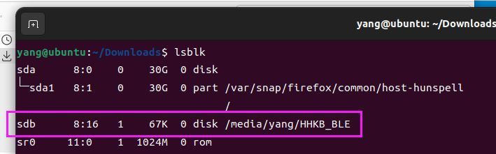

# Mass Storage Device Bootloader（磁盘模式）

基于lufa msd的，这里的磁盘模式是指键盘本身虚拟成为一个磁盘，不是说刷新固件时需要一个额外磁盘。

ydkb.io支持的较多键盘使用了这种方式。这种方式的好处即是不需要借助额外软件即可完成固件刷新和读取。

> [!yddh] 提醒：
> - 键盘的磁盘模式下显示的两个文件，“键盘名.BIN”和“EEPROM.BIN"，它们只是映射了主控FLASH和EEPROM的内容而“虚拟”出来的文件。
> - 每次重新进入刷机模式时它们的文件日期显示是固定的，不要用文件日期来判断是不是更新成功。


## 刷新出错的处理

把这一条放在最前面。如果刷错固件或者没刷成功的，导致无法再进入刷机模式，特别是双模的键盘，只需要把键盘的电源开关关掉或拔掉电池，然后再重新进入刷机模式，刷好正确的固件即可。


## Windows下刷机方法

刷机的方式基本都一致，一般是按住左上角键或者其他某个指定的键不放（具体看ydkb.io对应键盘里有显示的刷机说明），插入USB进入刷机的磁盘模式。再把固件的bin文件（不需要区分大小写）拖到磁盘里覆盖原文件即可。


## Mac下刷机方法

macOS，请按照下面步骤，使用命令行方式刷新固件。

这里举例，下载的文件是 HHKB_BLE.BIN，放在了 Downloads 目录里。

macOS上提示的连接到设备的信息这里就不多讲，连上显示磁盘后，先在终端里执行如下命令，其中HHKB_BLE是磁盘的名称。有的磁盘名称可能后面有空格，输入名称后可尝试按Tab自动完成来获取完整的名称。

```macOS
diskutil umount /Volumes/HHKB_BLE
```

执行后得到的结果是 <code>Volume HHKB_BLE on <span style='color:red'><b>disk2</b></span> unmounted</code>，记住这里的`disk2`，你的系统里可能是其他数字。然后接下来执行如下命令，注意这条里的disk2与上一条命令的得到的结果对应。

```macOS
sudo dd if=./HHKB_BLE.BIN of=/dev/disk2 seek=4
```

> [!ydda] 特别注意
> - 一定不要改动`seek=4`。

上面的`./HHKB_BLE.BIN`是 因为我在Download目录里运行的命令，所以使用的相对路径。也可以如下使用绝对路径，不用完全手打，在命令打到`if=`后，直接把BIN文件拖到终端命令窗口，它会自动获取该BIN文件的绝对路径。

```macOS
sudo dd if=/Users/yang/Downloads/HHKB_BLE.BIN of=/dev/disk2 seek=4
```

等待命令完成后就刷新成功。比较新的Bootloader会自动退出刷机模式，有的则需要手动退出。整个操作过程如下图。


## Linux下刷机方法

> [!yddh] 提醒：
> - 以下方面由网友 tb600211 686294 提供，我在Ubuntu 20.04下测试可刷新成功。
> - 不保证所有Linux版本下均可用。如不行，在需要刷固件的时候，用win刷新。

1. 键盘进入刷机模式，同时下载好固件
2. 使用下面命令写入固件，注意其中的 `of=/dev/sdb`，可能你的系统会有所不同，在我的示例里它是我电脑的第二个磁盘，所以是sdb。`./HHKB_BLE.BIN`是相对路径，你也可以使用BIN文件的绝对路径。<br>
```linux
sudo dd if=./HHKB_BLE.BIN of=/dev/sdb seek=4
```
3. 还要再补上一条命令。这条命令执行时刷机模式下的固件写入指示灯（如果有）才闪烁。<br>
```linux
sync
```

执行时所显示的内容如下图。


上面的 `/dev/sdb`，可以使用 `lsblk` 命令查看。



## 如果反复进入磁盘模式

如果出现这个问题，多半是因为下载的bin文件不对。可以随便用一个txt文件编辑器打开bin文件，看看内容是不是空的。或者用16进制查看器，查看文件前面是不是全是FFFF。

解决方法是多刷新（Ctrl+F5）几次页面重新下载固件，然后重新刷入。


## 如果提醒下载文件有错

如果下载时遇到提醒“下载文件有错，Shift+F5刷新页面后重试”，就多用Shift+F5刷新几次页面，或者进Chrome的隐身模式下载一下。在下载文件前加入了一个简单的检测机制，以避免下载到的是空文件从而引起“反复进入磁盘模式”的问题。


## 如果无法覆盖bin文件
如果直接覆盖bin提示空间不足，打开资源管理器显示隐藏文件，看看这个磁盘里除了xxx.bin和eeprom.bin外，是否还包含了其他文件，如果电脑本身有中毒为新磁盘写入了文件占用了空间，则替换xxx.bin时就会提醒空间不足，造成无法替换。

