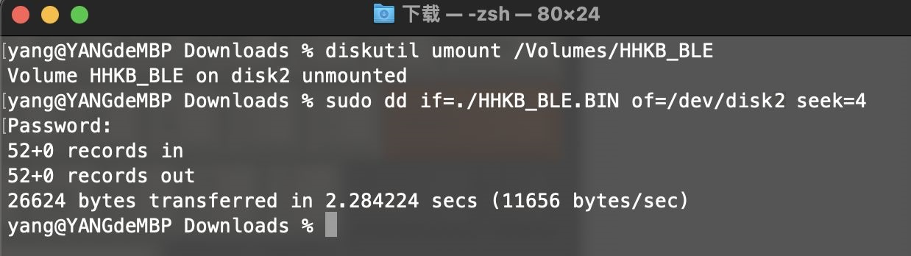

# Mass Storage Device Bootloader（U盘模式）

基于lufa msd的，这里的U盘模式是指键盘本身虚拟成为一个U盘，不是说刷新固件时需要一个额外U盘。

ydkb.io支持的较多键盘使用了这种方式。这种方式的好处即是不需要借助额外软件即可完成固件刷新和读取。

> [!yddh: 提醒：]
> - 键盘的U盘模式下显示的两个文件，“键盘名.BIN”和“EEPROM.BIN"，它们只是映射了主控FLASH和EEPROM的内容而“虚拟”出来的文件。
> - 每次重新进入刷机模式时它们的文件日期显示是固定的，不要用文件日期来判断是不是更新成功。


## 刷新出错的处理

把这一条放在最前面。如果刷错固件或者没刷成功的，导致无法再进入刷机模式，特别是双模的键盘，只需要把键盘的电源开关关掉或拔掉电池，然后再重新进入刷机模式，刷好正确的固件即可。


## Windows下刷机方法

刷机的方式基本都一致，一般是按住左上角键或者其他某个指定的键不放（具体看ydkb.io对应键盘里有显示的刷机说明），插入USB进入刷机的U盘模式。再把固件的bin文件（不需要区分大小写）拖到U盘里覆盖原文件即可。


## Mac下刷机方法

> [!ydda: 重要：]
> - Mac务必严格按照下面步骤，不然可能刷新不成功。
> - 此方面暂时不适合 macOS 13 Ventura，暂时换用后面的命令行方式。
> - macOS 13可能目前与各种MassStorage Bootloader有点兼容问题。https://github.com/ARMmbed/DAPLink/issues/982

##### 键盘自身进入刷机的U盘模式方法都是相同的，但Mac下复制文件方法不同。

> +|+> 1

1. 先在U盘里删除固件里的"键盘名.bin"这个文件。


2. 再在废纸篓里也要删除它(对Mac来说这一步非常重要)。


> +|+> 2

3. 将新下载的bin保持文件名与之前删除的bin文件一样，再复制到U盘里(注意先后)。


4. 待文件复制完成后，右键推出U盘或按Esc退出，刷机完成。

5. 这是针对4的补充：部分比较新的bootloader，在文件复制完后，会自动退出。这时Mac下提示未正确退出之类的是正常现象。

> [!yddh: 提醒：]
> - 如果在废纸篓里删除后，复制文件时还是提示空间不足，那么退出刷机模式然后再重新进刷机模式，再重新操作。

> +|+> 3

##### macOS 13 Ventura 可使用如下方式

这里举例，下载的文件是 HHKB_BLE.BIN，放在了 Downloads 目录里。

macOS上提示的连接到设备的信息这里就不多讲，连上显示U盘后，先在终端里执行如下命令，其中HHKB_BLE是U盘的名称。

```macOS
diskutil umount /Volumes/HHKB_BLE
```

执行后得到的结果是 `Volume HHKB_BLE on disk4 unmounted`，记住这里是`disk4`，然后接下来执行如下命令，注意这条里的disk4与上一条命令的得到的结果对应。

```macOS
sudo dd if=./HHKB_BLE.BIN of=/dev/disk4 seek=4
```

等待命令完成后就刷新成功。比较新的Bootloader会自动退出刷机模式，有的则需要手动退出。整个操作过程如下图。




## Linux下刷机方法

> [!yddh: 提醒：]
> - 以下方面由网友 tb600211 686294 提供，我在Ubuntu 20.04下测试可刷新成功。
> - 不保证所有Linux版本下均可用。如不行，在需要刷固件的时候，用win刷新。

1. 键盘进入刷机模式，同时下载好固件
2. 使用下面命令写入固件，注意其中的 of=/dev/sdb，可能你的系统会有所不同，在我的示例里它是我电脑的第二个磁盘，所以是sdb。<br>
```linux
sudo dd if=./HHKB_BLE.BIN of=/dev/sdb seek=4
```
3. 还要再补上一条命令。这条命令执行时刷机模式下的固件写入指示灯（如果有）才闪烁。<br>
```linux
sync
```

执行时所显示的内容如下图。


## 如果反复进入U盘模式

如果出现这个问题，多半是因为下载的bin文件不对。可以随便用一个txt文件编辑器打开bin文件，看看内容是不是空的。或者用16进制查看器，查看文件前面是不是全是FFFF。

解决方法是多刷新（Ctrl+F5）几次页面重新下载固件，然后重新刷入。


## 如果提醒下载文件有错

如果下载时遇到提醒“下载文件有错，Shift+F5刷新页面后重试”，就多用Shift+F5刷新几次页面，或者进Chrome的隐身模式下载一下。在下载文件前加入了一个简单的检测机制，以避免下载到的是空文件从而引起“反复进入U盘模式”的问题。


## 如果无法覆盖bin文件
如果直接覆盖bin提示空间不足，打开资源管理器显示隐藏文件，看看这个U盘里除了xxx.bin和eeprom.bin外，是否还包含了其他文件，如果电脑本身有中毒为新u盘写入了文件占用了空间，则替换xxx.bin时就会提醒空间不足，造成无法替换。

