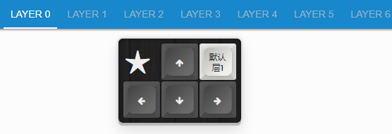
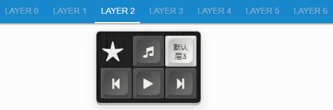
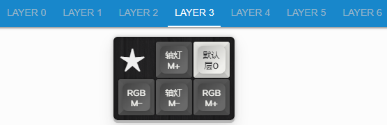

# 设置默认层

当前查看的内容是

```mindmap
> -a -vh 0.6
YDKB
  <层切换>
    瞬时开启层，优先层(按键时才有效)
      瞬时开启层
      瞬时开启层 | 层开关
      按键 | 瞬时开启层
      修饰键 & 瞬时开启层
    开关层(可保存状态)
      层开关
      瞬时开启层 | 层开关
      跳转到层
    <默认层(一直开启的层)>
      层0始终为开启
      <设置默认层>
```

设置一个层为默认层，默认层就是指一直开启的层，不能被关闭。

## 应用示例

一般默认层作为整体布局的切换来使用，比较合适。这里稍后补充另外的示例

## 备份待改
这里以Staryu的设置为例子。一共设置了4层，层0的右上角按键是 `默认层1`，即将层1设置为默认层，层1的这个键则是 `默认层2`，层2的这个键则是 `默认层3`，层3的这个键则是 `默认层0`。整体实现的效果就是每按一次这个键，就将下一层设置为默认层，按键就切换一次，最后在层3的时候又将层0设置为默认，一个循环。







