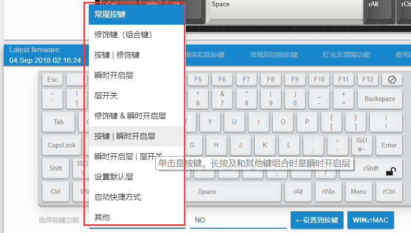

# 按键功能总述

一部分功能可以从界面上直接选。还有一些复杂一点的则从下图里面的列表选择，当鼠标指向时本身也有对应的功能提示。




一共大致分为以下这些。

```mindmap
YDKB
  按键功能
    常规按键
      常规104键盘上能见到的按键
      其他一些国家或地区键盘上的键
    组合键(修饰键组合键)
      修饰键加按键的组合如Win+Shift+S
      仅多个修饰键同时如Hyper(Ctrl+Shift+Cmd+Opt)
    多媒体键和系统键
      系统音量控制
      音乐播放控制
      计算器，屏幕亮度控制等
    鼠标模拟键
      鼠标上下左右移动
      鼠标滚轮上下左右
      鼠标按键等
  层切换
    瞬时开启层，优先层(按键时才有效)
      瞬时开启层
      瞬时开启层 | 层开关
      按键 | 瞬时开启层
      修饰键 & 瞬时开启层
    开关层(可保存状态)
      层开关
      瞬时开启层 | 层开关
      跳转到层
    默认层(一直开启的层)
      层0始终为开启
      设置默认层
  特殊功能
    灯光控制和增强功能
      轴灯背光控制
      RGB灯光控制
      额外实现的特殊功能按键
      蓝牙控制按键等
    火力模式按键
    内置预设宏(暂时未支持自定义宏)
      启动快捷方式
```

