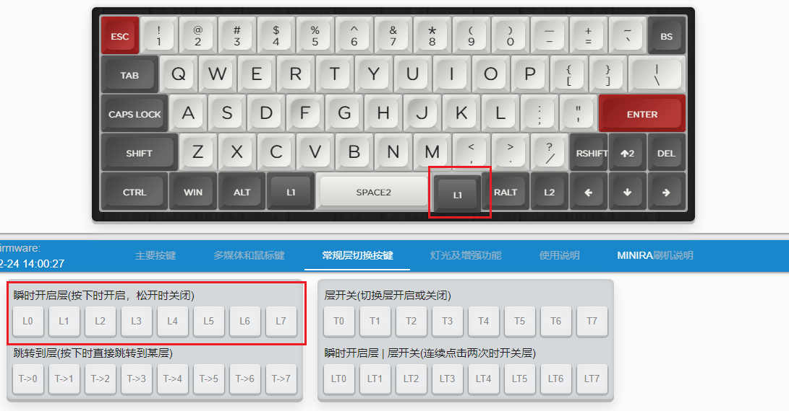
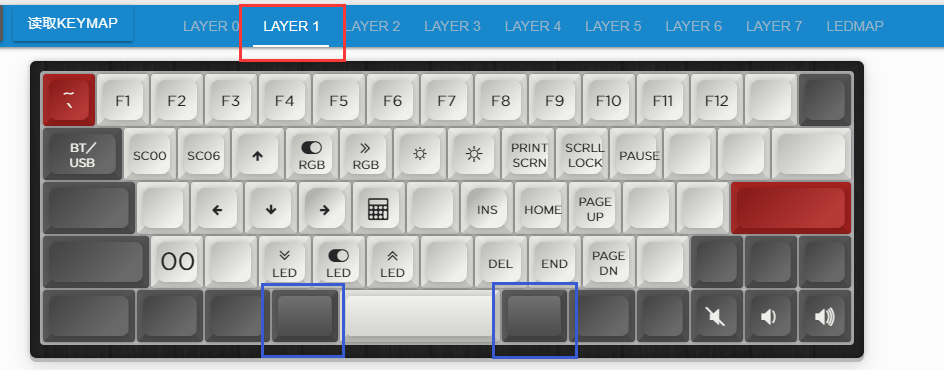

# 瞬时开启层

类似于量产键盘的FN，属于最常用也是入门必学会的功能之一。一般人理解的Fn+1输出F1，最基础就是用这个来实现。

FN只是按键功能的统称，为了显示方便，在ydkb.io的固件里，将对应的各层使用L0到L7来显示，分别代表瞬时切换到0到7层。

简单以60来举例说，在Layer 0，选择一个键，然后把它设置为L1。

然后切换到Layer 1，再对Layer 1的按键进行设置，还记得在Layer 0里，蓝色方框两个是L1。

像如上图设置之后，当键盘位于默认层的时候，蓝色方框中的任意一个L1按住不放的同时，同按键盘上的其他键，键盘输出的就是Layer 1上设置的按键，而不是Layer0上的了。这样就实现了所谓的Fn(这里是L1)+1=F1, Fn+方向右=音量加，等功能。

如果是上面没有设置的按键，等于是透明的，就往更低的层透明，如果更低的层有按键，就输出那个按键。比如L1+A，因为在Layer1上没有设置A键，然后透明到Layer 0，所以依然还是输出A。

L1只是一个简单的举例，因为键盘一共有8层可用，所以虽然60键盘不大，比如是61个按键，那么一共可设置的按键也足有61x8=488个。

