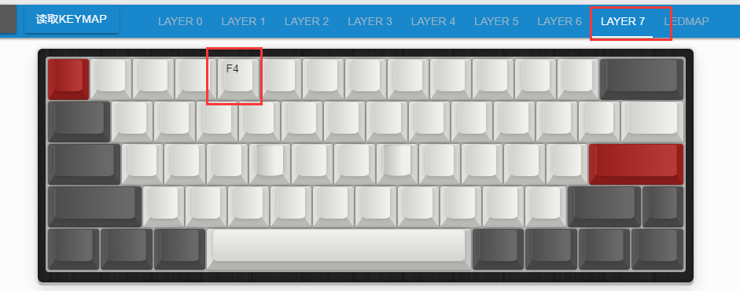

# 修饰键 & 瞬时开启层

此功能等于在瞬时开启层的同时，还要按下选择的修饰键。

举例来说，如果在层0设置原来的 `左Alt` 为 `Alt并瞬时开启层7`，如下图：

然后在层7，将原来数字是4的位置，设置成F4。这样的结果就是，在层0的时候，按下Alt+4时，因为这里Alt会同时开启层7，所以实际按下的键是Alt+F4。

以上举例只是其中一种用法，另外的比如左右shift可以设置为不同的功能，比如左Shift是普通的Shift，然后右Shift同时打开层x。