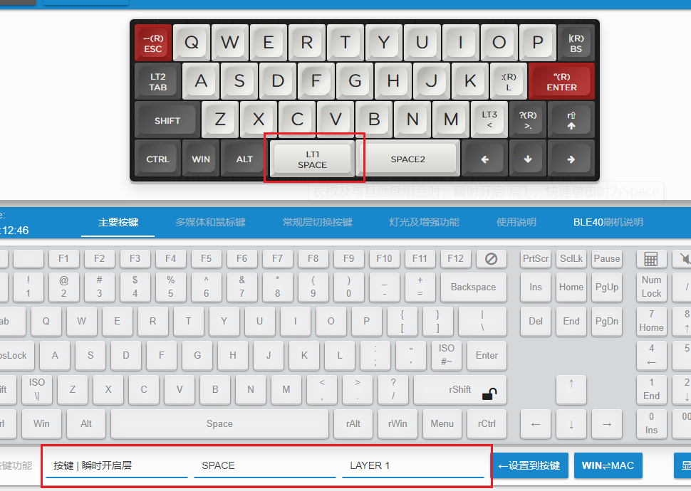
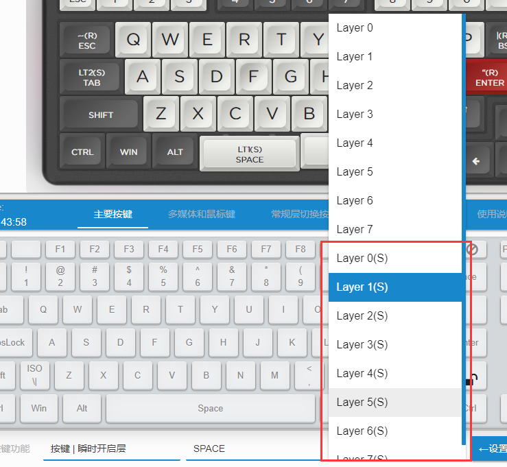

# 按键 | 瞬时开启层

单击是按键，长按及和其他键组合时是瞬时开启层。  
小键盘特别有用，或者想更好的利用双空格或单空格SpaceFn。  
SpaceFn介绍参考：https://geekhack.org/index.php?topic=51069.0  
Dual-role Keys参考：https://geekhack.org/index.php?topic=41685.0

首先说一下这个功能的要点。
  1. 单击是按键，其触发方式和普通按键不同，普通按键是按下时触发，而这里的按键是松开按键时触发。
  2. 长按是瞬时开启层，长按的时长略有要求的，响应速度不及单独的瞬时长按快。
  3. 如果要实现长按按键，那么，因为按下并长按，是瞬时开启层，所以实际是双击并保持按下。

如果按下的时候就触发按键，那么就没法判断用户操作的是单击还是长按了。所以实际它的判断逻辑是：

用户按下按键A开始计时，
  1. 如果松开了按键A，时间在200ms内，就发送一次点击了一下这个按键A。
  2. 在1按下按键的200ms内又按了一次按键A，并且保持按住不放，就是长按这个键A。
  3. 如果按下了另一个按键B，那么这个键A的动作也是瞬时开启层，但是，最后放开按键A时如果时间未超过200ms，那么一次就会发送A、B两个按键。
  4. 计时的时间超过了预设的200ms，没再按其他的键，那么键A的动作直接就是瞬时开启层，并且执行这个操作，再按其他键B的时候，键盘发送的也就是A键所开启层的对应的按键B。

> [!ydda: 注意上面第3项]
> - 3这一项对于SpaceFn这种用法，特别是单空格的，十分重要，必须要有这个延迟才能保证快速打字时，按下空格后立刻有按下来的键，不会被识别成 开启层。

但是，并不是所有按键都需要这么用，所以在ydkb的固件里，又增加了另一种 `按键 | 瞬时开启层` 的工作模式。  
与上面的区别主要在部分3，只要按下其他键，不需要延迟就直接判断为瞬时开启层。这个模式和键盘的win键有些相似，单按是win键，和其他键组合按时立即触发对应效果。

BLE系列的都已更新支持Layer(S)，其实如果有比较新的固件更新，2019下半年的，也应该是支持的。

然后这个功能也有一个限制

> [!ydda: 注意一个功能限制]
> - 单击时触发的“按键”，必须是一个常规按键，不能是修饰键或修饰键组合键。
  
实际应用中，`按键 | 瞬时开启层` 中的 `按键` 是不适合玩游戏的，有可能遇到一个问题

> [!ydda: 有可能遇到的问题]
> - 因为这个按键是松开时触发一下，所以像某些游戏里，按空格是跳跃，按得重(久)就跳得高(久)。
> - 但是空格若设置成了“按键 | 瞬时开启层”，那每次单击就只是很短的触发一下，就不适合用在这里了。
  
> [!yddh: 实际使用时，这里给一些使用建议:]
> - 注意它作为按键时，因为是抬起时生效，所以感觉上会比其他按键略有延迟，这个很容易习惯。
> - 如果是像空格或者是其他的键，按了后立即要去连续按其他键的，建议使用不带(S)的，这时做为瞬时开启层时，要习惯一下按下后开启层操作的延迟，不要放手太快。
> - 按键基本不会与其他键一起连按，同时又想瞬时开启层操作快速时，使用带(S)的Layer。

不同的人操作习惯有区别，所以最好自己体会它们之间的差别后，再去灵活的设置。就我个人而言，是选择双空格其中一个经常敲的设置为纯粹的空格键，而另一个设置为带(S)的 按键 | 瞬时开启层。

下面图示一下设置方法。

另一种 `按键 | 瞬时开启层` 的设置方法，就是下拉选择层的时候，选择带(S)就行。

