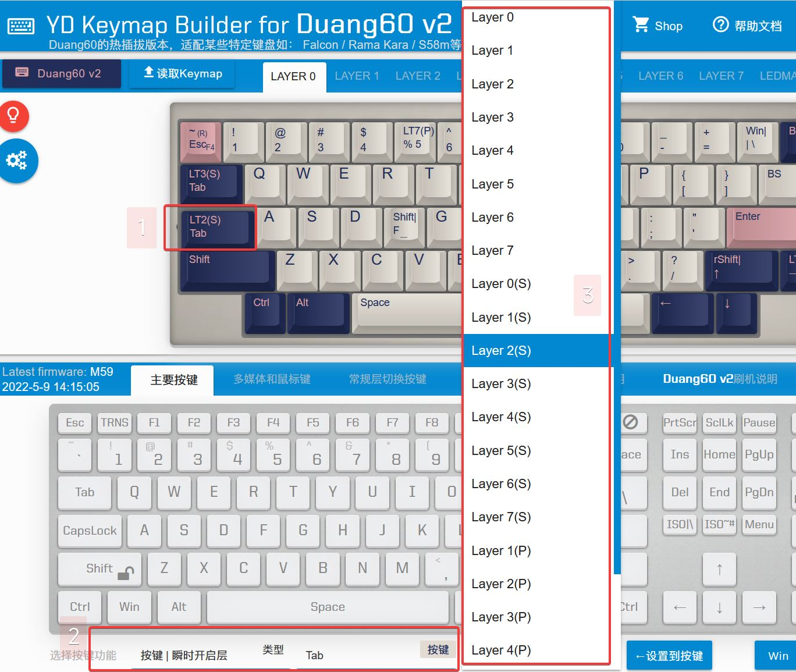

# 按键 | 瞬时开启层

单击是按键，长按及和其他键组合时是瞬时开启层。  
小键盘特别有用，或者想更好的利用双空格或单空格SpaceFn。  
SpaceFn介绍参考：https://geekhack.org/index.php?topic=51069.0  
Dual-role Keys参考：https://geekhack.org/index.php?topic=41685.0

## 功能要点
首先说一下这个功能的要点。
  1. 单击是按键，其触发方式和普通按键不同，普通按键是按下时触发，而这里的按键是松开按键时触发，<u>所以作为单独按键触发时会有延迟</u>。
  2. 长按是瞬时开启层，长按的时长略有要求的，响应速度不及单独的瞬时长按快。
  3. 如果要<u>实现长按按键</u>，那么，因为按下并长按，是瞬时开启层，所以实际是<u>双击并保持长按</u>。

如果按下的时候就触发按键，那么就没法判断用户操作的是单击还是长按了。

## 设置方法
设置方法如下图：

  1. 上方选中要设置的按键。
  2. 功能里选择 `按键 | 瞬时开启层`，设置 `按键`，<u>必须是一个常规按键，不能是修饰键或修饰键组合键</u>。
  3. 再设置 `瞬时开启层` 对应的层，这里还有三种不同的处理方式选择：`常规LT`，`LT(S)`，`LT(P)`。

## 三种模式详解

### 1LT x 和 LT x(S) 的区别：
  1. LT是完全依赖长按时间的，也就是必须长按超出预设的时长(200ms)，才会触发它为瞬时开启层的功能。
  2. LT(S)除了按键时长外，如果有按键中断，也会触发瞬时开启层的功能。

> [!yddh: 实际使用时的建议]
> - 如果想更快地执行的`按键`功能，就使用LT，这时在使用`瞬时切换层`时，就需要按下稍等一下不要太快放开。
> - 如果想更快执行`瞬时切换层`功能，就使用LT(S)，这时在使用它的`按键`功能后，就需要稍微停顿一下，不然在按下一个按键太快时，功能会被执行为`瞬时切换层`。
> - 具体可以自行体会，在不同的按键上根据自己使用习惯灵活使用。

举个实例，LT适合SpaceFn那样的操作，必须要有这个延迟才能保证快速打字时，按下空格后立刻有按下来的键，不会被识别成 开启层。

### 2LT x 和 LT x(P)的区别

LT(P)是在2022年5月29日才开始支持的功能，只有在支持此特性的键盘上才有显示出来。

LT x(P) 与 LT x 的最大区别是，它在 <u>瞬时开启x层之后，还会再触发x层在此位置的按键</u>。当x层的按键位置为 `透明` 时，LT x(P)和LT x的作用就是一样。

> [!ydda: 实际使用时特别注意]
> - 目前有一定使用限制，禁止套娃。LT x(P)在按下后，所执行的x层的位置的按键，不能设置为 TAP二合一功能按键，可以设置常规按键，多媒体键，修饰键组合键都是可以的。

它的用法就有待各位开发了。简单说几个用法：
  1. 按键短按为一个功能，长按为另一个功能。比如实现数字<kbd>5</kbd>正常短按是<kbd>5</kbd>，长按是<kbd>F5</kbd>或<kbd>Ctrl++R</kbd>。
  2. 更复杂的二合一按键，比如1800mini上的原来的 <kbd>RShift | Up</kbd>，这里如果把它设置为<kbd> LT 7(P) | Up</kbd>，然后在Layer7里把这个按键设置为 <kbd>RShift</kbd>。如此可以单击按键是<kbd>Up</kbd>，长按的时候是<kbd>RShift</kbd>并且因为也开启了层7，所以<kbd>RShift++X</kbd>这时可在层7里重新设置，就可以实现类似 <kbd>RShift++Enter</kbd> 输出 <kbd>"</kbd>。
