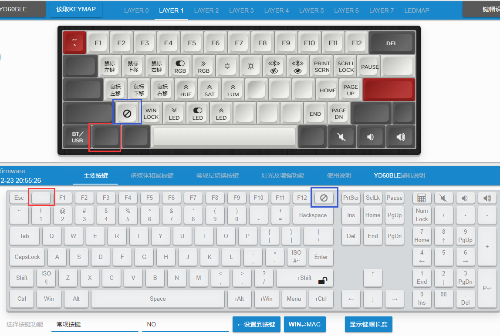

# 层概念(核心思想)

TMK的重要特色之一就是层，理解并运用好层是用好键盘的关键。不用急着一下子理解本篇的全部内容，实际在使用键盘过程就会逐步的加深理解了。

ydkb.io默认支持的是8层，从 Layer 0 到 Layer 7

```mono text
    Keymap: 8 Layers                   Layer: 按键矩阵
    -----------------                   ---------------------
         ____________ 优先级                   _______________________
        /           / | 高                    / ESC / F1  / F2  / F3   ....
    7 /___________// |                      /-----/-----/-----/-----
    6 /___________// |                     / TAB /  Q  /  W  /  E   ....
    5 /___________/  |                    /-----/-----/-----/-----
    :   _:_:_:_:_:__ |               :   /LCtrl/  A  /  S  /  D   ....
    :  / : : : : : / |               :  /  :     :     :     :
    2 /___________// |               2 `--------------------------
    1 /___________// |               1 `--------------------------
    0 /___________/  V 低            0 `--------------------------
```   

每个层上面都有若干个按键，一共8个层。

> [!ydda: 理解和使用层时，重要的两点]
>  - 开关状态
>  - <u>优先级</u>

简单说明一下这两点。

```ad-yddcol0
##### 层的开关状态

实际际使用过程中，类似于Fn+1=F1的操作，是通过切换层的状态来实现的，每个层都有开或关两种状态（默认层和0层，是一直开启不可关闭）。当我们按下一个键时，输出到电脑的按键值，就是由层状态加上按键矩阵来决定的。
```

```ad-yddcol1
##### 层的优先级

层是有优先级的，从层7优先级最高，层0优先级最低。当按下一个按键时，从高优先级的往下查找按键，如果哪个层处于开启状态，并且对应的位置上有按键，那么，键盘就输出这个按键。

<u>也因此，务必要理解，层切换并不是在层之间“跳转”。</u> 
```

举个例子说明一下优先级。比如打开了层4，然后在层4上用L2，L2虽然生效了且按下时打开了层2，但因为层4依然还是开启状态，它的优先级更高。所以层4对应位置有按键时，会触发的是层4的按键，而非层2的。

再举个例说明一下层的开关状态，比如Fn+1=F1这个操作： 层0一般来说是默认层，它是默认开启的。在这个例子里，Fn对应的实际是L1，即瞬时开始层1（后面实际设置时还会讲到的），那么，它的实际操作逻辑是
  1. 按下Fn(L1)时，开启层1，此时8个层的状态是层0和层1是开，其他的是关。
  2. 再按下“1”，从最高层往下，到层1的时候，层1是开启的，并且这个按键上设置为F1，输出F1。
  3. 放开Fn(L1)，关闭层1，此时只有层0这个默认层是开启状态了。这时再按1也就只会输出1了。

默认情况下按键只要不设置就是透明的，这样就会向低优先级的层去查找按键，如果不想让它查，只想让那个按键无效，可以在那一层里将按键设置为 **禁用** ，如下图，蓝色方框里的键就是设置 **禁用** 的，想要再重新设置回透明也可以用红色方框的键。


