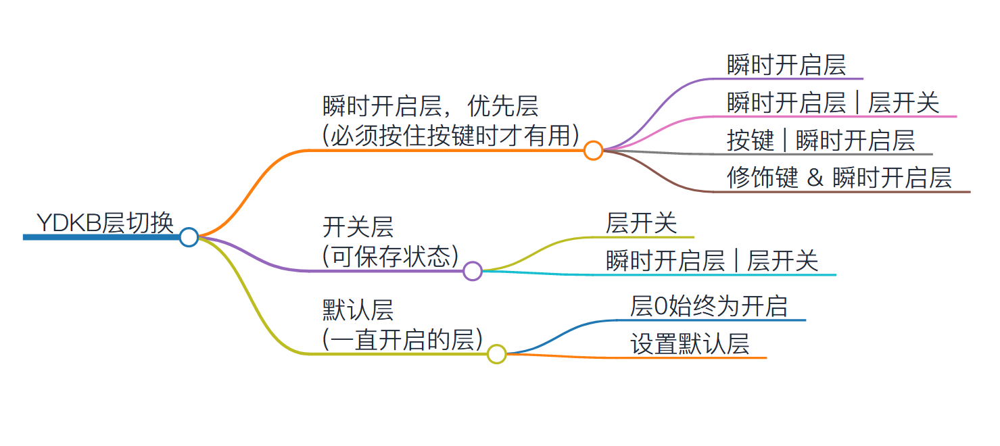

# 层概念(核心思想)

TMK的重要特色之一就是层，理解并运用好层是用好键盘的关键。不用急着一下子理解本篇的全部内容，实际在使用键盘过程就会逐步的加深理解了。

ydkb.io默认支持的是8层，从 Layer 0 到 Layer 7

```mono text
    Keymap: 8 Layers                   Layer: 按键矩阵
    -----------------                   ---------------------
         ____________ 优先级                   _______________________
        /           / | 高                    / ESC / F1  / F2  / F3   ....
    7 /___________// |                      /-----/-----/-----/-----
    6 /___________// |                     / TAB /  Q  /  W  /  E   ....
    5 /___________/  |                    /-----/-----/-----/-----
    :   _:_:_:_:_:__ |               :   /LCtrl/  A  /  S  /  D   ....
    :  / : : : : : / |               :  /  :     :     :     :
    2 /___________// |               2 `--------------------------
    1 /___________// |               1 `--------------------------
    0 /___________/  V 低            0 `--------------------------
```   

每个层上面都有若干个按键，一共8个层。

> [!ydda] 理解和使用层时，重要的两点
>  - 开关状态
>  - <u>优先级</u>

简单说明一下这两点。

```ad-yddcol0
##### 层的开关状态

实际际使用过程中，类似于Fn+1=F1的操作，是通过切换层的状态来实现的，每个层都有开或关两种状态（默认层和0层，是一直开启不可关闭）。当我们按下一个键时，输出到电脑的按键值，就是由层状态加上按键矩阵来决定的。
```

```ad-yddcol1
##### 层的优先级

层是有优先级的，从层7优先级最高，层0优先级最低。当按下一个按键时，从高优先级的往下查找按键，如果哪个层处于开启状态，并且对应的位置上有按键，那么，键盘就输出这个按键。

<u>也因此，务必要理解，层切换并不是在层之间“跳转”。</u> 
```

举个例子说明一下优先级。比如打开了层4，然后在层4上用L2，L2虽然生效了且按下时打开了层2，但因为层4依然还是开启状态，它的优先级更高。所以层4对应位置有按键时，会触发的是层4的按键，而非层2的。(注：这个限制在2023.01.16后新固件里，不存在了)


## 新的层切换逻辑

在2023.01.16开始的固件里，根据这几年使用者的一些实际使用反馈。重新设计了整个层切换的逻辑。



-  层的逻辑有些变化，将所有层功能分成三个大类。
-  使用瞬时开启的层，临时也被设为优先层，如果此层上有设置按键，则优先响应它，其次才根据所有层的开启状态从高往低查找。

它不会破坏以往逻辑，但配合新的逻辑，符合更多人对于层切换的期望。例如：
1. 在使用瞬时开启L1时更期待触发的是层1按键。新逻辑下在高层处于开启状态时，也可触发低层的按键。
2. 可以使用例如 L1+T1 来开启或关闭层1了，而不会因为最后L1松开又将层1关闭。

目前只有部分键盘更新了这个新逻辑，细节和说明会再进一步完善。

