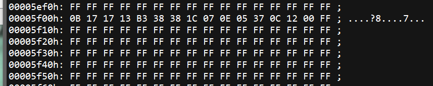
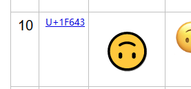

# 按键宏

如果有宏功能有需要的，部分键盘目前可以使用 VIA 或 Vial 的固件。

YDKB的固件目前仅支持自带的宏，不支持自定义宏，所以这部分说明暂时不可用。

这里暂时用来记录一点杂活。后期会再重新编辑整理的。

## 测试固件

http://dev.ydkb.io 的固件，在Just60、YD60BLE、BLE660C、BLE980C、HHKB BLE的灯光及增强功能里，增加了一个Macro1键。

它对应的宏保存在了固件BIN文件的0x5f00地址处，以00结尾

比如上面这一段 0B 17 17 13 B3 38 38 1C 07 0E 05 37 0C 12 00, 这个宏的作用就是打出http://ydkb.io。

解释一下它的格式。这部分不能仅参考TMK了，格式有一定的差异。

最简单的0x04到0x73，代表对应的按键。可以参考这里： 
https://github.com/tmk/tmk_keyboard/wiki/Keycode

0x84到0xF3，就是0x04到0x73加了Shift，所以上面图片中有一个B3，那就是0x33+0x80，打出冒号。常规的按一次按键或输出一个字符，就只需要占用一个字节。

除了上面这些，还有一些，是用来当命令用的。

01 xx，就是按下xx键，02 xx，弹起xx键 
81 xx xx，按下一个16位的action，82 xx xx，弹起16位action 
83 xx xx，按下并弹起一个16位的action 
补充说明：KEYMAP里面本身每个按键就是一个16位的action，所以用这个可以实现所有按键能用的功能，包括开关RGB之类键盘自身的功能，16位的存储时是低位在前，比哪一个16位action code是0xF00B(切换蓝牙/USB)，那么存储时顺序是 83 0B F0 

74 xx，等待xx的2倍ms，所以最大一次是520ms，按500ms用比较方便。精度2ms不是1ms。 
7F xx xx，输出一个unicode，仅支持Windows 
80 xx xx，这个等于输出一个1xxxxx的unicode，用来输emoji表情，emoji表情的unicode多为0x1Fxxx，超过16位了。仅支持Windows。

大概就是这些，反正现在能手写那个bin的可以玩一下。<color red>这些不用理解或记住，这个宏格式肯定之后是要用更简单的界面来生成的。</color>

emoji的代码可以在https://unicode.org/emoji/charts/full-emoji-list.html 查找。

比如上图这个，那么要输出它，就是80 43 F6 00，如果要两个，就80 43 F6 80 43 F6 00这样。

再比如输出“床前明月光”，找个在线转换工具，得到的结果是\u5e8a\u524d\u660e\u6708\u5149。宏的代码就是7F 8A 5E 7F 4D 52 7F 0E 66 7F 08 67 7F 49 51 00。就可以使用这个宏直接输出“床前明月光”。