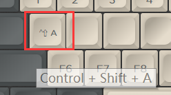

# 修饰键(组合键)

修饰键，指ctrl shift alt(option) win(command)这些，此按键功能可以用来设置某个键为ctrl+shift这样的多个修饰键一起按的情况，也可以设置成修饰键组合键，比如win+e，ctrl+shift+s这样的多个修饰键加上一个常规按键的组合键。

修饰键是没有先后顺序的，Shift+Ctrl+Alt与Ctrl+Alt+Shift作用是一样的，都代表这三个修饰键同时按下。

按键功能里选择修饰键（组合键），然后接着选择好按键以及修饰键，再点击设置到到按键，就能修改在键盘上选择的按键了。如下图（注意中间是按键，右边是修饰键或修饰键组合）

这时上面设置好的按键，鼠标指向时，已经提醒该键的功能为Ctrl+Shift+A了。

也可以使用键盘快速设置，但是只能使用左边的几个修饰键。比如选择一个按键后，直接按键盘的左Ctrl+左Win+C，就可以将这个按键设置成这样的组合键了。但是注意系统或一些软件本身的快捷键，是会触发的，那些没办法用这么设置，比如win+D就会回到桌面，这种可以用另一个方法，就是按住左修饰键，然后剩下的这个按键从网页上面点，如选择一个按键后，按住左Ctrl和左Alt，再去点A，就可以将选择的按键设置为Ctrl+Alt+A。

大部分软件里支持的快捷键就是这样的修饰键组合键。