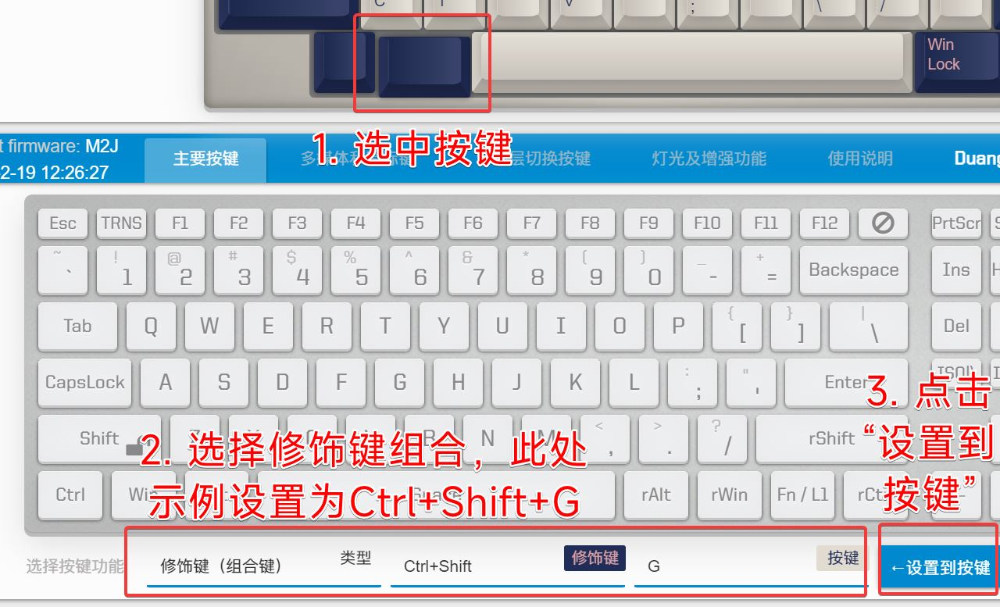
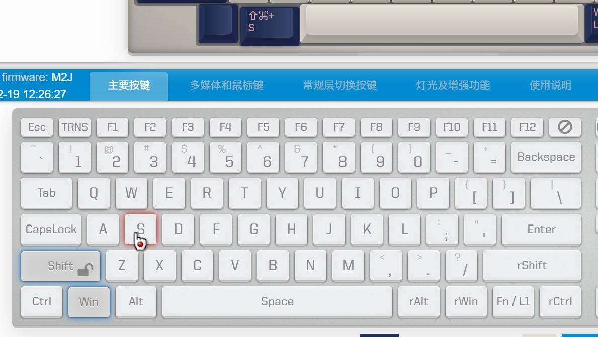
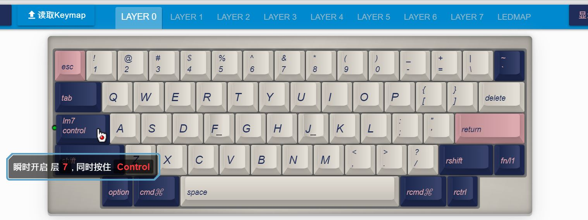
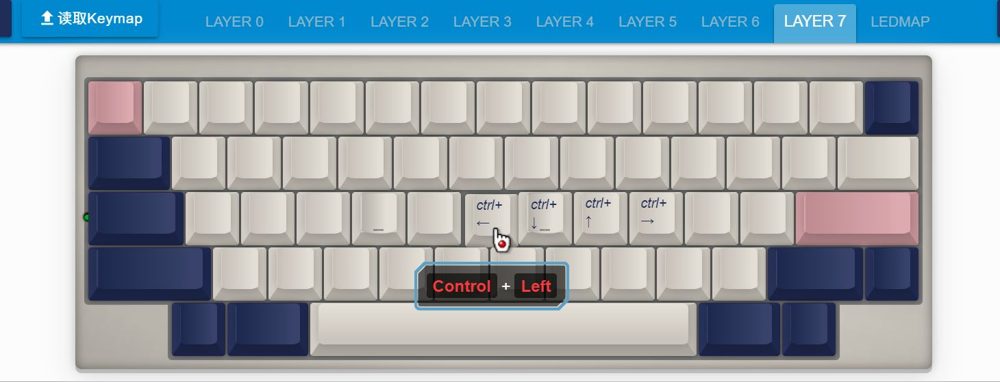
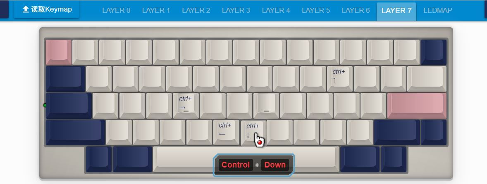

# 修饰键(组合键)
## 功能描述
修饰键，指ctrl shift alt(option) win(command)这些。此功能可以设置按键为
1. <kbd>Ctrl+Shift</kbd> 这样的多个修饰键一起按下。
2. <kbd>Win+E</kbd>，<kbd>Ctrl+Shift+S</kbd>这样的组合键。

## 设置方法

### 1 如果用鼠标点击设置，方法如下图。

### 2 用键盘快速设置
使用键盘快速设置，但是只能使用左边的几个修饰键。

先选中一个要修改的按键，再直接按键盘的 <kbd>LCtrl+LWin+C</kbd>，就可以将这个按键设置成这样的组合键了。

但是，有些组合键可能被系统或应用给占用了，比如win下的 <kbd>Win+Shift+S</kbd>，这时可以采用键盘加鼠标点击的方式。步骤是先选中要修饰的按键，然后直接按下键盘的<kbd>Win+Shift</kbd>，再用鼠标点击设置界面的<kbd>S</kbd>，完成设置。

一次要设置比较多的各种组合键时，方法2的速度会更快一些。

## 一点点增强

在2022年2月20日后的固件，增强了此功能。这个可以选择性地使用，一般用户不太会需要此种用法。

如果是按下设置 `修饰键组合键`时，原本也有修饰键是按住的，会抵消相同的修饰键。例如：
1. 先按住<kbd>LCtrl</kbd>键，再按设置为 <kbd>LCtrl++Left</kbd>的某个键，这时会抵消掉<kbd>LCtrl</kbd>，而触发的是<kbd>Left</kbd>。
2. 先按住<kbd>LShift</kbd>键，再按设置为符号<kbd>{</kbd>的按键，它实际是<kbd>LShift+[{</kbd>，所以抵消<kbd>LShift</kbd>后发送是符号<kbd>[</kbd>。

但是它有不完美的地方，在开始按住修饰键的时候，它就已经在系统里注册为按下了，后面抵消的时候实际上是需要先弹起它。相当于会额外触发一次单独的按下弹起修饰键。

如Shift键的单独按一次，在某些输入法里面可能是切换中英文开关等，就会影响使用。这时如果一定要使用此特性，就建议关闭输入法的Shift切换中英文功能，改用其他组合键切换。

但像Ctrl在大部分系统或软件里，单独按是没什么作用的。所以我上面举的例子，如果配合[修饰键 & 瞬时开启层](edit-keymap/layer-mods.md) 来实现 <kbd>Ctrl+H J K L</kbd>  或  <kbd>Ctrl+N P B F</kbd> 为方向键。

下面就是实际这个方式的设置：
1. 将LAYER 0的 <kbd>Ctrl</kbd> 设置为 <kbd>LM7 Ctrl</kbd>，设置方法见: [修饰键 & 瞬时开启层](edit-keymap/layer-mods.md) 。
2. 将LAYER 7 的 <kbd>H J K L</kbd> 或 <kbd>N P B F</kbd> 设置为对应的 <kbd>LCtrl ++ 方向</kbd> 。

要注意，这样就无法触发<kbd>LCtrl+H</kbd>等了，但它只抵消<kbd>LCtrl</kbd>，所以可通过再按下 <kbd>RCtrl</kbd>，来触发<kbd>RCtrl+H</kbd>等。或者自行再设置另外的层切换键去触发。

举例只是抛砖引玉，具体如果安排和使用此特性，还要看各位自行发散。

## 一点点补充
为了防止误触发，[默认命令按键](magic-commands.md)是不能使用修饰键组合键触发的。

也就是不能使用 <kbd>LShift++U</kbd> 和<kbd>RShift</kbd> 这样两个按键来触发默认命令，<kbd>U</kbd>必须是单独的一个按键。