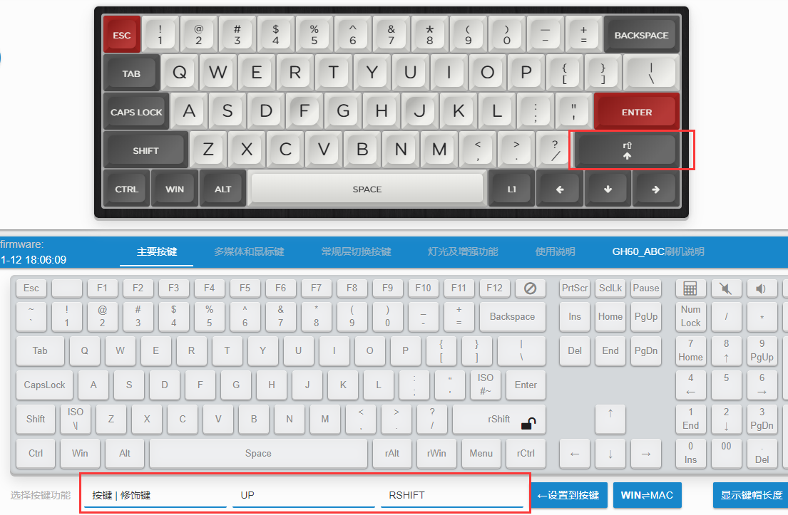

# 按键 | 修饰键

明白了前面的 `按键 | 瞬时开启层` 后，这个 `按键 | 修饰键(s)` 的功能就非常好理解了。  

单击是按键，长按及和其他键组合时是修饰键。

> [!ydda] 使用本功能前注意
> - 常规键盘是没有这种复杂功能的，大部分人用不到此功能。
> - 如果要使用此功能，务必熟悉下面各种要点和区别，看不太明白的可以实际操作试试。
> - 它只能按程序设计的逻辑去工作，不要只用 <u><b>你想它要怎么工作的</b></u> 去思考。

## 功能要点

首先说一下这个功能的要点。
  1. 单击是按键，其触发方式和普通按键不同，普通按键是按下时触发，而这里的按键是松开按键时触发，<u>所以作为单独按键触发时会有延迟</u>。
  2. 按下后再按其他的键，或者长按一定时间不放，是修饰键。
  3. 如果要实现长按按键，那么，因为按下并长按是修饰键，所以需要双击并保持按下。
  4. 该功能默认的工作模式与 `按键 | 瞬时开启层` 的 LT(S)是相似的。
  5. 如果想实现与 LT 默认时的方式，下一节里有举例可以使用 LT(P) 来实现。

如果按下的时候就触发按键，那么就没法判断用户操作的是单击还是长按了。

> [!ydda] 一个限制
> - 单击时触发的“按键”，必须是一个常规按键，不能是修饰键或修饰键组合键。  

举个例子，在下图的设置里，这是一个常规的60 Poker配列，这种没有单独的方向键，但我们依然可以将右下角的四个键作为方向键，其中原来右Shift这里被设置成了 `单击是方向上 | 长按是右Shift`，这样就又有上下左右了。不过，这个方向并不适合用来玩游戏，因为前面也说了，这种要实现长按方向上的操作，就需要双击并按键这个按键，而不是直接长按住。 

如果是为了游戏，可以单独在层1设置一个它只是方向上的，然后需要游戏的时候将那一层打开或作为默认层。

当然它的应用方法远不止上面举例这一种。

## 扩展一下

在2023年9月27日开始更新的固件，才开始支持 `按键(k) | 修饰键` 这个功能，以实现LT类似的，非Interrup模式的复合按键。

在2023年9月27日之前的固件，也可以暂时使用下面方法来变通实现。

前面提过默认它的工作方式是类似 LT(S) 的。举例，如果把F键设置成 <button>LShift | F</button> 这样的模式，正常快速打字的时候，F键可能和后面的键会同时按下，这时本来想要的是F，但是它触发了LShift。

这时就需要类似 LT x，非S的触发方式了。虽然通过 `按键 | 修饰键` 无法设置，但是可以利用  `按键 | 瞬时开启层`中的LT (P) 来实现。

继续这个例子，把 LAYER0 的 F 键设置为  <button>LT7(P) F</button> ，然后把 LAYER7 的 F 键设置为 LShift。这样就做到了单击是 F 键，长按和组合的时候是 LShift，其工作模式是类似LT x默认那样。

这样会多占用一个层。但那个层也能拿来和 LShift 做一些其他的组合。利用 [修饰键(组合键)](edit-keymap/mods-key.md)里提到的增强部分。就还可以 F 加上 WASD 做方向键(只是举例)。

