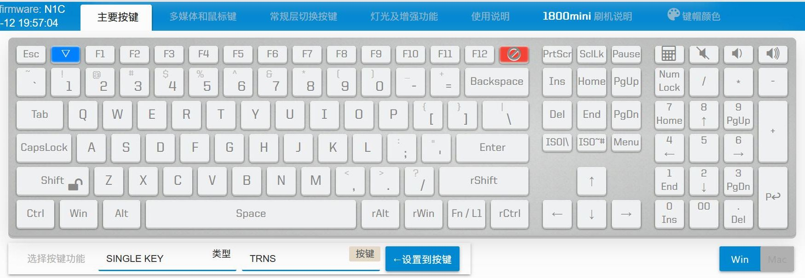

# 常规按键

就是通常的按下代表一个键的按键，大部分按键可以直接从图形的按键界面选择，如下图所示。这些键在设置的时候，也可以直接从电脑上可以使用的一个键盘上按，不用在下图选择。

这里面也有几个特殊的。
  - ▽，清除一个按键，将其设置为TRANS(穿透到更低层)，也可以用鼠标中键点击，快速设置
  - F12右边的，那个是禁用按键，也可以用Shift加鼠标中键点击，快速设置

一般来说一个层里，默认未设置的键，就是TRNS的，如果要将这个键在此层中禁用，就设置为`禁用`

另外还有一个`Fn/L1`，照顾一下一些新接触的用户，所以其实这个就是L1的，然后作用类似于量产键盘的Fn。用Fn加其他的键，就是设置在Layer 1里面的按键。更具体的说明可以参考 [瞬时切换层](edit-keymap/l-layer.md)

## 补充说明

对于常规按键，USB模式下都支持，但BLE系列在无线模式不支持JIS的按键，以及F13到F24这些按键。

