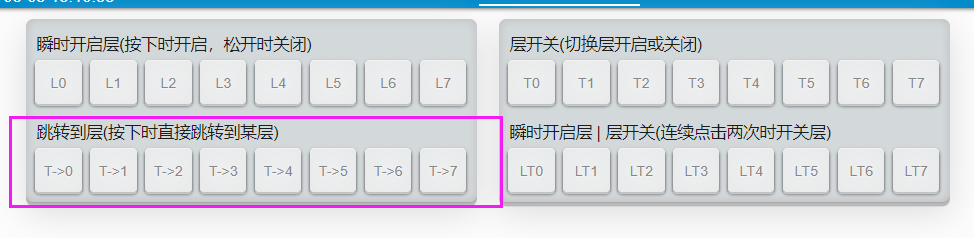

# 跳转到层

当前查看的内容是

```mindmap
> -a -vh 0.6
YDKB
  <层切换>
    瞬时开启层，优先层(按键时才有效)
      瞬时开启层
      瞬时开启层 | 层开关
      按键 | 瞬时开启层
      修饰键 & 瞬时开启层
    <开关层(可保存状态)>
      层开关
      瞬时开启层 | 层开关
      <跳转到层>
    默认层(一直开启的层)
      层0始终为开启
      设置默认层
```

在常规层切换按键里，还有几个这样的，跳转到层。



它们的作用是：打开要跳转的层，关闭其他层。

举例来说，比如有如下操作步骤。
  1. 层0是默认层是开启状态，这时如果用T3打开层3，在层3上设置一个T->2。
  2. 按下这个键后，层2打开了，层3关闭了，当前的最高打开的层就是层2了，主要的有效按键就是层2。 

而如果这时在T3上使用T2的话，那么只是再打开了层2，而层3依然是开启状态，那么主要的有效按键是在最高打开的层3上。

所以取名叫跳转到层，实际应用表现就是可以随意的从一个层跳到另一个层，不受层状态影响。