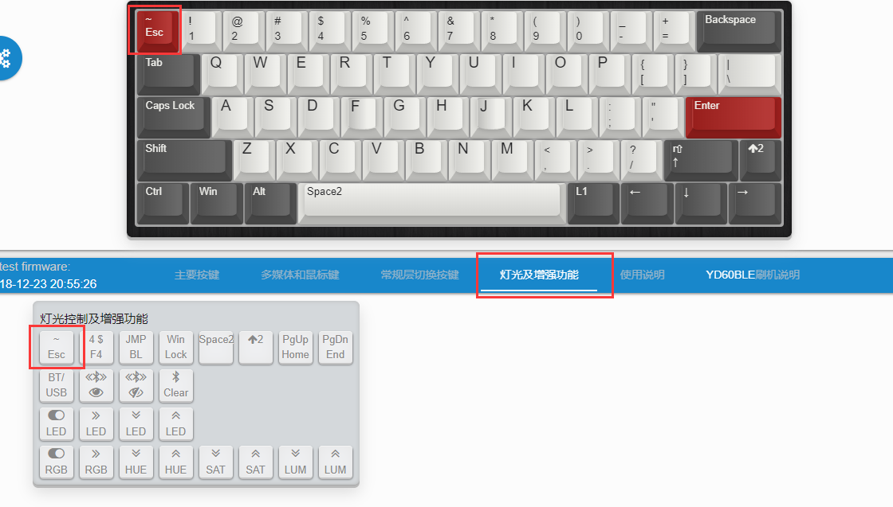
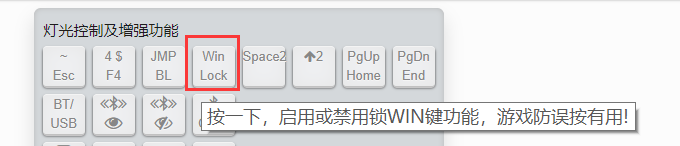

# 增强功能按键

这些是固件预设的一些增强功能按键，其中一些就是针对此键盘的功能（如蓝牙控制、灯光控制等），另一些就是用前面介绍的按键功能不容易实现或者实现起来不够优雅的功能。每个键盘所具有的增加功能不完全相同。

如下图，这是YD60BLE的 **灯光和增加功能** 选择界面。然后<kbd>Esc</kbd>键就设置了这里的第一个增强功能，即单按按键是<kbd>Esc</kbd>，与<kbd>Shift</kbd>一起按时输出符号 `~`。

增强功能里面可选的按键，当鼠标指向的时候，会有对应的功能说明的。

这里其他的按键，第二排是控制蓝牙的，第三排控制单色背光，第四排控制RGB灯，在后面再讲到如何使用。