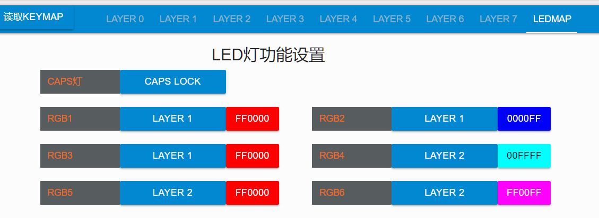
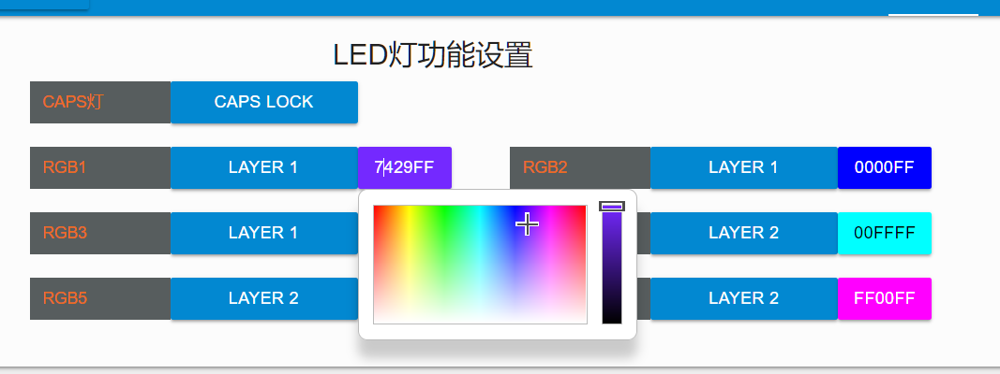
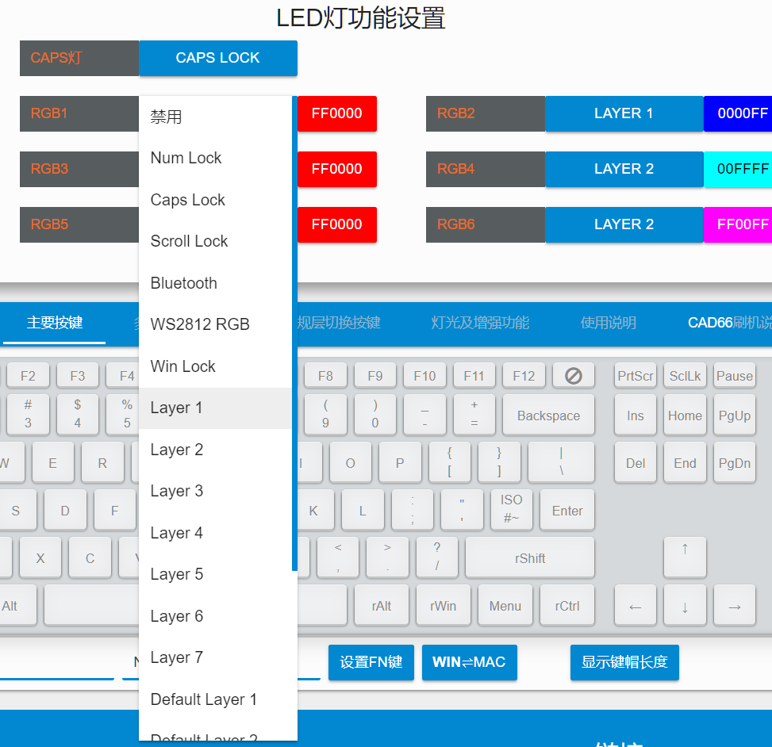

# 指示灯 LEDMAP

YDKB所支持的键盘，大部分的指示灯功能，是可以自定义的。

默认作为连接状态指示灯或低电量指示，这些是预置的无法修改。自定义主要是指如下文所说的功能。


## 指示灯类型

如果键盘支持LEDMAP功能，在选择层的最后面显示有一个** [ LEDMAP ]** 的标签。

```ad-yddcol0

```

```ad-yddcol1

```

指示灯大致分为三类。

| LED类型??30% | 说明 |
| --- | --- |
| 单色指示灯 | 只能设置功能。另外有的RGB某个特定颜色也有作为单色指示灯来设置|
| RGB指示灯 | 除了设置指示功能外，还可以指定颜色。 |
| 不可定义指示灯 | 这部分比如充电指示灯，还有一些特定用途的，不支持在LEDMAP里修改，它本身也有特定的指示作用 |

> [!yddh] 提示
> - 部分键盘的LEDMAP里支持设置RGB底灯和背光灯，但是它们仅在关闭RGB灯效和背光时才能作为LEDMAP的指示功能生效。


## 指示灯功能



目前支持最多的8个指示灯，每个指示灯可以单独指定它的功能，支持的功能在它的下拉列表里。鼠标指向时会有说明。

| 功能??30% | 说明 |
| --- | --- |
| 未设置 | 即不设置此指示灯，保持让它默认 |
| 禁用 | 用于设置一些背光和RGB灯。未安装或不想使用选择此项，更加节能 |
| Num Lock<br>Caps Lock<br>Scroll Lock | 传统键盘状态指示灯 <br>需要注意的是蓝牙模式下与系统不是同步的 <br>具体参看本页最后说明 |
| Win Lock | 配合对应功能使用，当Win键锁定时亮起 |
| Layer 1...7 | 当前该层为打开状态时，则亮起该指灯 |
| Default Layer 1...7  | 当前默认层为设置的值时，则亮起该指灯 |
| 工作模式(部分键盘有) | 指示灯亮时为USB连接，不亮时为蓝牙 |
| 接蓝牙模块(部分键盘有) | 部分键盘接蓝牙模块需占用LED灯的IO，需要设置此项 |
| WS2812 RGB(部分键盘有) | 部分键盘使用RGB灯需占用LED灯的IO，需要设置此项 |


## 蓝牙模式下指示灯

> [!ydda] 蓝牙模式下指示灯使用注意
> - 在蓝牙模式下，Num Lock, Caps Lock, Scroll Lock这些指示灯，无法同步显示电脑的这三者状态。
> - 蓝牙模式下，实际是第一个按键为Caps等时，就切换对应指示灯开关。只有在USB模式下是同步显示的。
> - 不同步时，可使用<kbd>Shift</kbd>+对应按键，如<kbd>Shift</kbd>+<kbd>Capslock</kbd>，这时CapsLock会生效但其指示灯不会变(因为第一个按键不是CapsLock)。
> - 合理利用这一点可在蓝牙下反转指示灯使用，如让numlock灯在亮时关，灭时开，可以省电。
