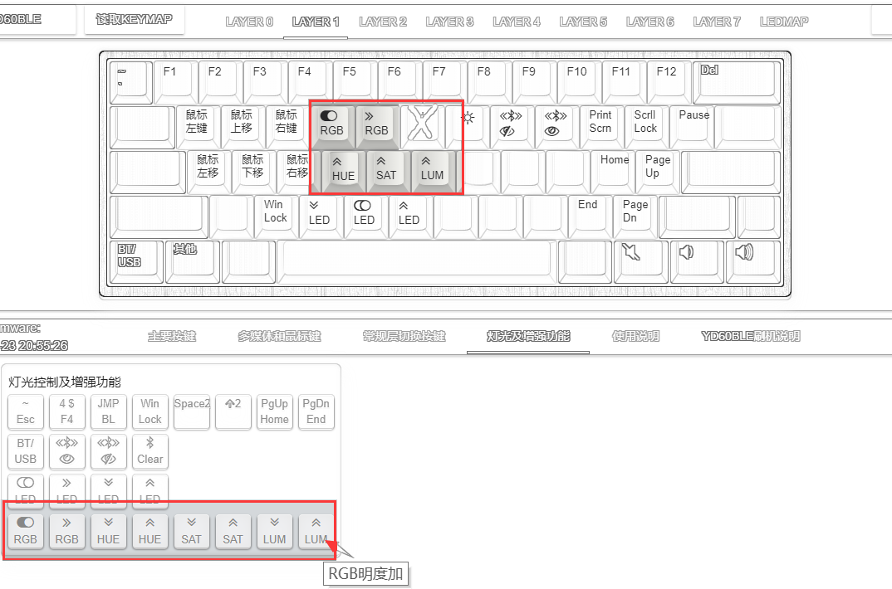
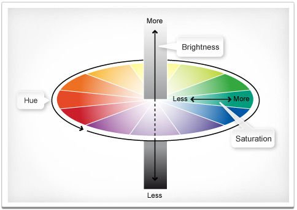

# RGB灯光

RGB灯光包括两种

| 类型 | 键盘 |
| --- | --- |
| RGB底灯 | 有的按键背光是单色的，但是也有RGB底灯。 一般Esc四灯也是接的RGB底灯。 |
| RGB轴灯 | 有RGB轴灯的键盘一般有RGB底灯，但有的也没有。 |

不管是底灯还是轴灯，YDKB支持的键盘使用的RGB灯都是支持单独控制的，所以可以实现丰富的灯效。

## 控制方法

目前来说，控制RGB灯的方式是统一的，即轴灯和底灯同时一起控制，未来会考虑将它们功能模式也分开。

从 **灯光及增强功能** 里，选择如下几个控制RGB的按键设置到键盘上。在鼠标指向时会有按键的功能说明的。 

一共8个可设置的RGB控制按键，从左到右依次是

| RGB 开关 | RGB 模式加 | RGB 色相减 | RGB 色相加 | RGB 饱和减 | RGB 饱和加 | RGB 明度减 | RGB 明度加 |
| --- |-|-|-|-|-|-|-|

看我的图上，其实我只设置了5个，没有必要全设置。配合<key>Shift</key>可以补充没设置的按键，如:
  * <key>Shift+RGB模式加</key>就是RGB模式减
  * <key>Shift+色相加</key>就是色相减。

关于RGB调色的方式，看下面这个图。Hue是色相、Saturation是饱和、Brightness叫明度或亮度。一般主要调节的是Hue色相来调节颜色变化。

目前只有 固定颜色模式 / 呼吸灯模式 / 蛇形游走， 这三个模式，支持修改颜色。 同样的部分动态模式亮度修改也是无效的。

## RGB底灯的灯效模式
大部分的支持RGB底灯的键盘，灯效如下：

| 模式 | 效果|
| --- | --- |
|1|固定颜色|
|2-5|四档呼吸|
|6-8|统一变色，三档速度|
|9-14|彩虹变色，三档速度，两个方向|
|15-20|蛇形游走，三档速度，两个方向|
|21-23|霹雳游侠，三档速度|

> [!yddh] 提醒
> - 部分键盘情况特殊的，比如Minira，在轴灯为单点亮或涟漪模式时，底灯是与轴灯联动的，而不是上面表中列出的设置的效果。

## RGB轴灯的灯效
有RGB轴灯的键盘，RGB底灯目前并没有单独分离控制，而是配合轴灯控制的，底灯的灯效与轴灯部分联动，有的轴灯灯效下，底灯是没效果的。

RGB轴灯灯效，根据键盘的不同，可能会略有差别，但大体支持的效果如下（下表是1800mini的供参考，名字目前都是我瞎取的）

> [!yddl] 支持RGB轴灯的键盘
> - 1800mini
> - Master98
> - Sairo64
> - X-8086K
> - x
> - BLE40
> - BLUP
> - Taichi 
> - THX30
> - ESWN

| 模式 | 效果 |
| --- | --- |
|1|固定颜色|
|2|彩色单点亮|
|3|彩色涟漪|
|4|层指示。当前打开的最高层，设置为非透明和禁用的按键，轴灯亮。不同的层指示颜色不同。|
|5-6|自动贪吃蛇，两档速度|
|7|彩色繁星|
|8|彩虹雨滴|
|9|赛马|
|10|激情碰撞|
|11-12|固定颜色呼吸，两档速度|
|13-14|统一变色，两档速度|
|15-18|彩虹变色，两档速度，两个方向|
|19-22|蛇形游走，两档速度，两个方向|
|23-24|霹雳游侠，两档速度|
