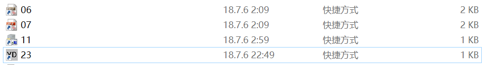
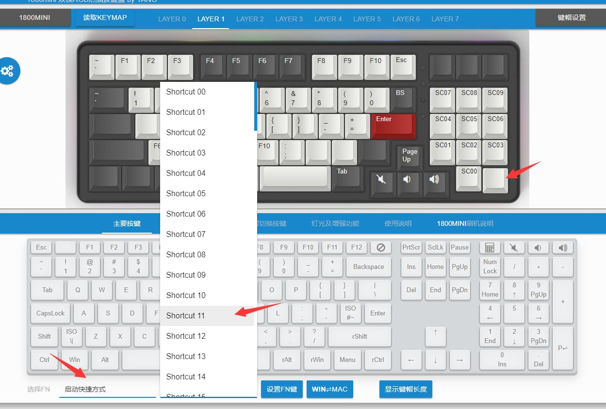

# 启动快捷方式

Mac系统本身就支持全局快捷键，所以不需要看这个，这个是适用于win系统的。

YDKB支持的键盘里，大部分都可用此功能。

## 原理

通过win+R，输入一个命令后，windows先从环境变量里添加的路径下去找对应的程序或快捷方式，看则运行，没有则提示找不到。直接开始菜单里输入“环境变量”就能找到设置的地方，或者网上以关键字“win+r 启动 快捷方式”  
搜索一下也会有不少的设置教程。

## 使用方法

ydkb.io支持从00到99，一共100项。对应的**快捷方式**就是00到99。把要启动的建立一个快捷方式，放到环境变量路径下的文件夹（可以是自己添加一个），如下图。

键盘上设置好对应的按键，序号与电脑上快捷方式的名称对应即可。

快捷方式并不仅限于应用程序，很多东西都可以创建快捷方式。比如快捷的打开某个文件，打开某个网址，以参数方式运行某个程序等等。

