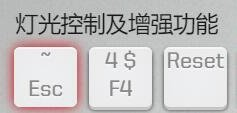
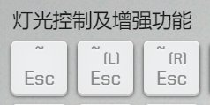
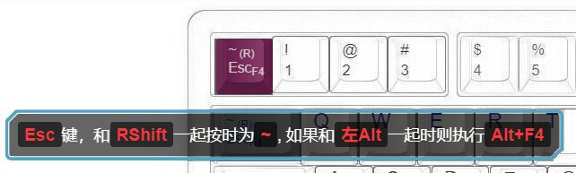

# Esc 与 \`\~

这是一个小尺寸键盘（65%及以下），或者说意愿把大键盘当小键盘部分来使用时，很有用的一个功能，用于将<kbd>Esc</kbd>和<kbd>\`\~</kbd>实现部分合用。

## 普通用法

在 `灯光及增强功能` 里，能看到下图这个的按键，就可以直接设置。

它的主要效果是：

| 按键 | 效果 |
| --- | --- |
| <kbd>~ Esc</kbd> | 触发是<kbd>Esc</kbd>键 |
| <kbd>Shift+~ Esc</kbd> | 实际会输出的是符号<kbd>~</kbd> |
| <kbd>Ctrl+Shift+~ Esc</kbd>| 触发的是<kbd>Ctrl+Shift+esc</kbd>(Windows任务管理器的快捷键)，而不会成为<kbd>Ctrl+\`~</kbd> |

需要符号的时候<kbd>\`</kbd>，一般是将另一层(如层1)的Esc位置设置为<kbd>\`\~</kbd>，那么用L1+Esc这两个键也可以打出<kbd>\`</kbd>了。

## 高阶用法

以上这么用可能会遇到的问题就是，<kbd>Shift+Esc</kbd>这一组快捷键不能使用了，这是打开Chrome任务管理器的快捷键。

所以又准备了一些新东西，这个应该是在2020年10月以后再有更新的键盘固件里，会有一些开始陆续添加。

在 `灯光及增强功能` 里，可以看到下面三个关于Esc 与 \`\~的选择。

其中有两个包括了L或R，也就是它们只针对 <kbd>LShift+~ Esc</kbd> 或 <kbd>RShift+~ Esc</kbd> 生效输出<kbd>\~</kbd>，另一个 <kbd>Shift+Esc</kbd> 依然保持原功能。

同时，还有一个彩蛋，如果在点击这个<kbd>~ Esc</kbd>进行设置时，<kbd>LAlt</kbd>是按住的，那么实际设置的按键会增加一个额外功能，功能提示如下。

<kbd>Alt+esc</kbd>在win下用得很少，其作用是在前台窗口之间切换，大家切换窗口更多是使用<kbd>Alt+Tab</kbd>。

因此，对于0层没有F4键的65%以下的键盘来说，可以考虑这样设置后，使用<kbd>Alt+esc</kbd>来触发<kbd>Alt+F4</kbd>的功能，这两个键的位置单手按起来也非常顺手。