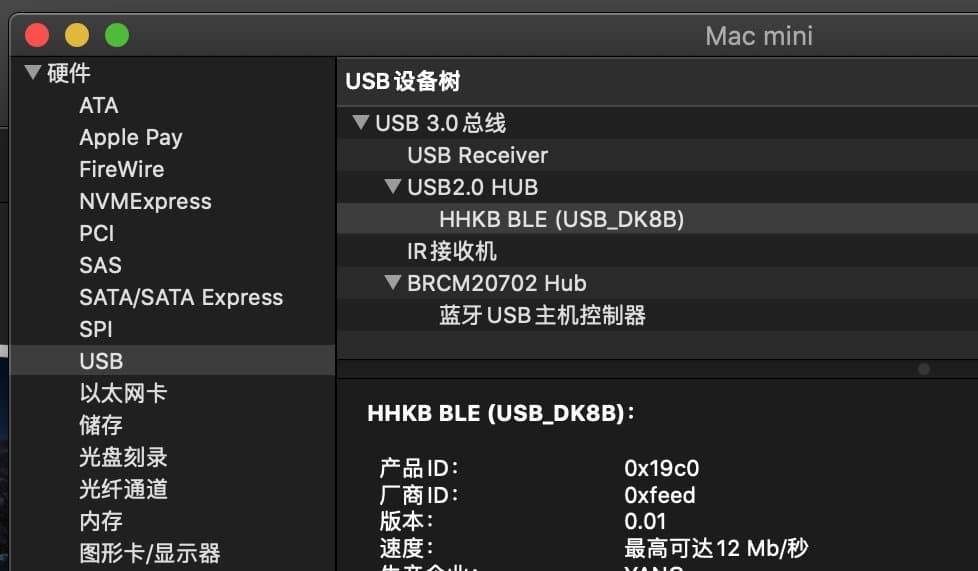

# VIA 固件更新
## 必要说明
ydkb.io 的固件为基于tmk，不支持VIA。

本页提供为部分YDKB的键盘的VIA的固件，更新固件后，即可使用VIA。

虽然固件文件不同，但是更新方法与ydkb.io一致。大部分使用 [Mass Storage Device Bootloader（U 盘模式)](bootloader/msd-bootloader.md)。

为了方便区分固件版本，在插上USB的时候，支持VIA的固件后面为(VIA_Dxxx)，xxx是固件日期；而YDKB的是(USB_Dxxx)。不同系统下查看这个名称的方法如下：

```ad-yddcol0
##### win10

在 <u>开始菜单 - 设置 - 设备</u> 里(不是设备管理器)，查看它的USB键盘名称(不是蓝牙连接名称)。


而本页支持VIA的固件显示名称如下：


```

```ad-yddcol1
##### Mac

在 <u>关于本机 - 系统报告 - USB</u>，如下图所示


```


VIA的固件功能随QMK，所以本帮助文档里面的大部分内容将无效。

## 当前支持键盘的固件和json文件下载

测试运营期，目前还未提交合并到via官方支持。所以更新下表固件后，连接VIA时，请使用 `File - Import Keymap`， 手动导入json文件。

| 键盘 | 下载地址 | 补充说明 |
| ---- | ---- | --- |
| Everest | [VIA固件和JSON文件](via-firmware/everest_via.zip) | |
| Mountain | [VIA固件和JSON文件](via-firmware/mountain_via.zip) | |
| YD67BLE | 待更新 | |


## 额外说明

RGB的控制与qmk有所区别，本页的固件，RGB的控制说明参考 [rgblight](features/rgblight.md)。  

在VIA中设置时，使用的是CUSTOM中的几个按键来控制

