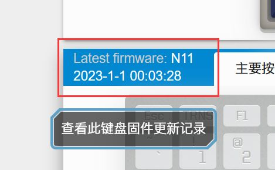

# YDKB 固件更新

本身每次使用 ydkb.io 设置好按键，下载并刷到键盘里的时候，就已经包含了当时最新的固件。

注意一下页面上的 Latest Firmware 的时间，如果比你上次刷新的要新，那么说明这个固件有更新了，直接再上传固件读取一次按键，重新下载回文件，就包含最新的固件，再刷入键盘，完成。

总之，改按键和更新固件实际就是同一个操作。

即使刷新失败，甚至是造成键盘无法识别，也不要担心，只要还能再进刷机模式，一般键盘就没什么大问题。

对于BLE系列的，如果刷失败或者刷错固件，造成了插USB无法识别，则是需要先关掉电池开关，再重新进入刷机模式，刷新固件。


## 查看当前固件版本

设备 <u>作为USB键盘连接时的名称</u> 大都包含了当前固件的日期，日期的计法说明见本篇最后。

### 1 将键盘用有线方式连接到电脑

> [!ydda: 重要]
> - 必须是有线连接下，才能查看其对应的USB设备名


### 2 查看有线键盘的USB设备名称
不同系统下查看这个名称的方法可能有所区别。

```ad-yddcol0
##### win10

在 <u>开始菜单 - 设置 - 设备</u> 里(不是设备管理器)，查看它的USB键盘名称(不是蓝牙连接名称)。


```

```ad-yddcol1
##### Mac

在 <u>关于本机 - 系统报告 - USB</u>，如下图所示


```


## Changelog 固件更新记录

键盘固件的更新记录可以在 ydkb.io 选择了对应的键盘后，点击 `Latest firmware` 后跳转到对应链接。




## 附：三位日期计法
| 年??10% | 19 | 20 | 21 | 22 | 23 | 24 | 25 | 26 | 27 | 28 | 29 | 30 | ... |
| --- |-|-|-|-|-|-|-|-|-|-|-|-|-|
| 计法 | J | K | L | M | N | O | P | Q | R | S | T | U | ... |

| 月??10% | 1 | 2 | 3 | 4 | 5 | 6 | 7 | 8 | 9 | 10 | 11 | 12 |
| --- |-|-|-|-|-|-|-|-|-|-|-|-|
| 计法 | 1 | 2 | 3 | 4 | 5 | 6 | 7 | 8 | 9 | A | B | C |

| 日??10% | 1...9 | 10 | 11 | 12 | 13 | 14 | 15 | 16 | 17 | 18 | 19 | 20 |
| ---- |-|-|-|-|-|-|-|-|-|-|-|-|
| 计 | 1...9 | A  | B  | C  | D  | E  |  F | G  | H  | I  | J  | K |
| 日 |  21 | 22 | 23 | 24 | 25 | 26 | 27 | 28 | 29 | 30 | 31 ||
| 计 |  L | M | N | O | P | Q | R | S | T | U | V ||