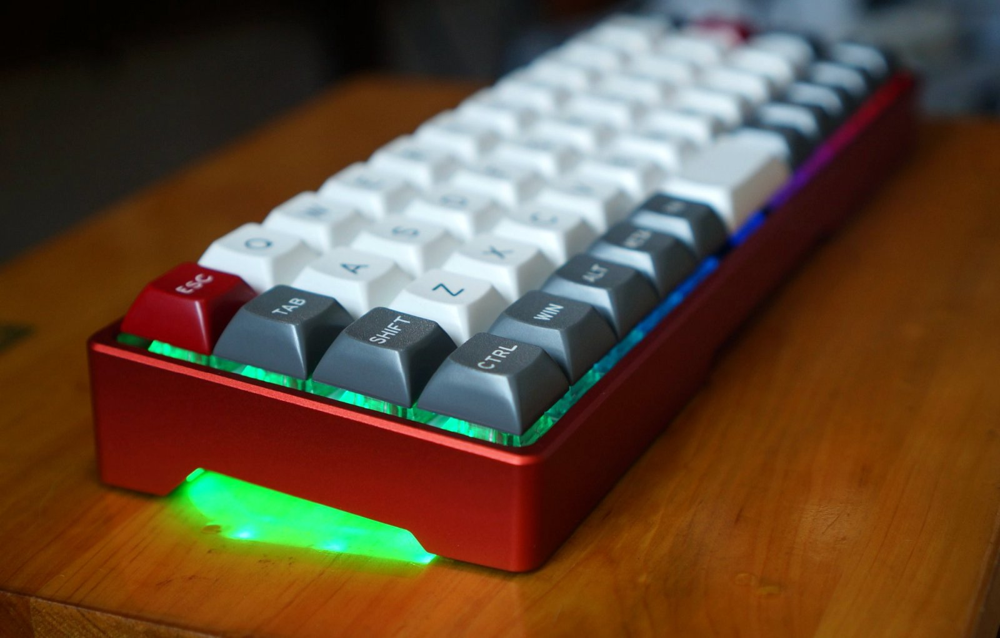

# BLUP / BLE40

|Author |YANG |
|:--- |:--- |
|Case |Xikii|
|MCU|Atmel32u4|

RGB双模40%键盘，BLUP(原YDP40v2)和BLE40两者相近，所以放在一起了。

## BLUP's hardware infomation

|COL|0|1|2|3|4|5|6|7|8|9|10|11|
|---|-|-|-|-|-|-|-|-|-|-|-|-|
|PIN|B4|B5|B6|C6|C7|E2|F0|F6|F5|F4|F1|E6|

|ROW|0|1|2|3|
|---|-|-|-|-|
|PIN|F7|D7|B2|B3|

|WS2812 Data|WS2812 Power|Bluetooth Power|IS31FL3737 SDB|
|---|-|-|-|
|D1|B7|D5|D4|

## BLE40's hardware infomation

|COL|0|1|2|3|4|5|6|7|8|9|10|
|---|-|-|-|-|-|-|-|-|-|-|-|
|PIN|D6|D7|B4|B5|B6|C6|C7|E2|F7|F6|F5|

|ROW|0|1|2|3|
|---|-|-|-|-|
|PIN|F4|F1|F0|E6|

|WS2812 Data|WS2812 Power|Bluetooth Power|IS31FL3737 SDB|
|---|-|-|-|
|B3|B1|D5|D4|

## 展示图

## 蓝牙配对

蓝牙配对主要参看，[BLE双模使用](ble-series/)

简单说不需要单独启用配对模式，只要蓝牙处于未连接并且可发现状态，就可以配对。mac和ios的搜不到在上面文档里也有写处理方法，另外出现连接异常时，也有处理方法。

在每次键盘启动（比如关掉开关重开，或者重新插入USB数据线），时左上角两个轴灯会先显示快速闪烁蓝色，代表蓝牙未连接，一旦蓝牙已连接，它们会变为绿色较慢闪烁，闪两三次后，自动熄灭。正常使用键盘时，也可以通过按 <kbd>LShift+RShift+S</kbd> 来查看蓝牙连接状态，指示方式同前面说的一样。

## 刷固件方式
参看[BootHID Bootloader](bootloader/boothid)

修改按键和更新固件，都是使用同样的刷新方式，在网站设置好按键后下载的HEX文件，已经包含了网站上最新的固件以及你所设置的按键。

