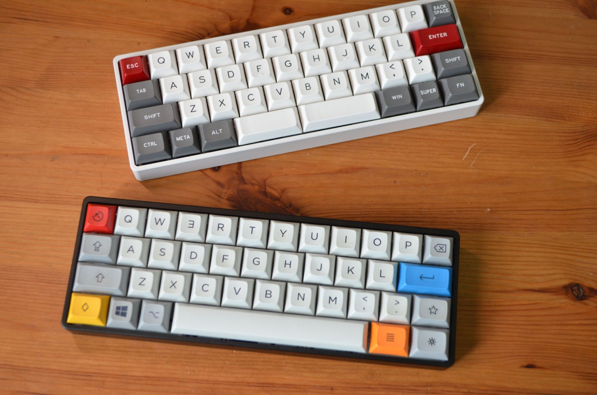

# Chicory

|Author |YANG |
|:--- |:--- |
|MCU|Atmel32u4|

## Hardware infomation

|COL|0|1|2|3|4|5|6|7|8|9|10|
|---|-|-|-|-|-|-|-|-|-|-|-|
|PIN|D6|D7|B4|B5|B6|C6|C7|E2|F7|F6|F5|

|ROW|0|1|2|3|
|---|-|-|-|-|
|PIN|F4|F1|F0|E6|

| Caps Lock LED | Backlight | WS2812 Data | WS2812 Power | Bluetooth Power |
|---|-|-|-|-|
| B7 | D0 | D1 | D4 | D5 |

## 展示图

by Prod

## 固件设置

Chicory固件使用tmk，在ydkb.io上进行设置，常见的功能均可通过网页进行设置。  
配列设置完毕后右上角选择下载-下载刷机工具及hex到桌面进行刷机。按住ESC插入数据线进入刷机模式。

## 空格提醒

如果使用6.25u空格，空格位置的外壳螺丝必须使用螺丝包里黑色超薄头螺丝，普通螺丝头会和卫星轴的钢丝冲突。

## 充电注意

建议使用电脑的usb口或者正规的5v充电器来充电，如果出现充电不当导致蓝牙失效的情况，后果自付。
