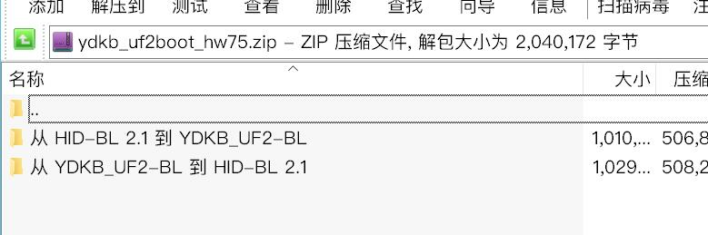

# 瀚文75 (HW75) 
## 开源地址

UF2 bootloader： https://github.com/yangdigi/uf2-stm32f103

TMK firmware: https://github.com/yangdigi/tmk_keyboard/tree/master/keyboard/hw75

## 固件更新

固件需要更新为 YDKB UF2 bootloader 或者 瀚文的 HID-BL v2.1 才能正常使用。

参考下文的 `更新到 YDKB UF2-BL 的方法`，可以直接将 HW75 原来的 HID-BL 1.0或2.x，更新为 UF2-BL。

如果不使用UF2-BL，使用原来的 HID-BL。稚晖君提供了BL的更新程序，更新说明参考： https://gitee.com/referencez/hw-75-firmware/tree/master/3.特殊操作

更新UF2-BL 或 HID-BL 2.1后，固件刷新的方法如下：

- 如果是 YDKB UF2-BL，按住<kbd>Fn</kbd>不放(如上图所示的物理位置按键)，再插USB线。键盘右上角位置黄灯闪烁，同时电脑显示一个名为<u>HW75</u>的U盘。右上角 下载.UF2固件，直接拖到U盘里就行（复制粘贴或右键发送到都可以）。它会自动刷新完后退出U盘。整个过程无需其他软件，支持macOS。

- 如果是 HID-BL 的，也是按住<kbd>Fn</kbd>不放再插USB线进刷机模式，烧录方法和之前是一样的，只是需要 HID-BL 2.1 支持。

小技巧：如已经刷过本固件，进刷机模式可不用拔线再插线。直接按下<kbd>LShift+RShift+B</kbd>(重启键盘快捷键)，再立即按住<kbd>Fn</kbd>键不放，即可进入刷新模式。


## 更新到 YDKB UF2-BL 的方法

如果想使用 YDKB UF2-BL，参考下面说明进行操作。

这是需要的文件，已经分类打包好： [ydkb_uf2boot_hw75.7z](keyboards/assets/ydkb_uf2boot_hw75.7z ':ignore')

压缩包里面包括两个文件夹，这里使用 `从 HID-BL  到 YDKB_UF2-BL`。



> [!ydda] 注意
> - 压缩包内的 `固件更新器v2.1.exe`，如果你的电脑提示不安全，临时关闭一下杀毒软件，再使用它。
> - macOS可用虚拟机(我测试用的PD18+Win11ARM)，完成UF2-BL更新(之后更新固件不需要虚拟机)。
> - 下文中提到使用固件更新器的地方，必须用压缩包里的这个版本。
> - 若提示缺文件 MSVCPxxx.dll，请安装 https://learn.microsoft.com/en-US/cpp/windows/latest-supported-vc-redist 的运行库 vc_redist.exe 的对应系统版本 。


##### 从 HID-BL 到 YDKB_UF2-BL

UF2-BL特点：使用UF2-BL，更新固件时不需要借助更新器，且支持macOS等其他一些系统。

如果你的是先行团未更新过BL，那么大概率是 1.0的HID-BL；如果不是或自己更新过了，就是2.x。

文件夹里包含如下四个文件。
```
1. hw75 hid-bl 1.0 to ydkb_uf2_v231.bin
1A. UPDT_BL_APP_16K_for_1.0.bin
3A. UPDT_BL_APP_16K_for_2.x.bin
4A. ydkb_uf2boot_hw75_v231.bin
固件更新器v2.1.exe
```

1.0的HID-BL升级方法最简单(这个方法不适合 HID-BL 2.x)：
1. 先按Fn不放插线，键盘进入刷机模式。查看 `设置 -- 蓝牙和其他设备`，最下方`更多设备和打印机设置`里。如果刷机模式下显示的名称是 STM32F HID Bootloader，就是1.0；是HID-BL则是2.x。
2. 将文件 `1. hw75 hid-bl 1.0 to ydkb_uf2_v231.bin` 拖到`固件更新器v2.1`上，就像刷一次固件一样，只要正常刷完就行。
3. 接下来什么也不用干，等待自动完成，会自动识别为键盘然后就可以用了。这个升级已经包含了2023.1.4 DN14版本的键盘固件。

> [!yddh] 提醒
> - 因为HID-BL 2.0的有点兼容小问题（这也是为什么要推出HID-BL 2.1），所以上面简单方法不会推出适合 2.x用的。这个方法在 HID-BL 2.0下会变砖（2.1不会），为了避免被误操作到2.0上，2.x 更新到 UF2-BL的方法统一使用下面这种。

下面是另一种方法，2.x需要使用这个，1.0也可以使用：
1. 先按Fn不放插线，键盘进入刷机模式。按不同BL版本，拖文件，待烧录100%完成。
- 如果是HID-BL 1.0，将 `1A. UPDT_BL_APP_16K_for_1.0.bin` 拖到`固件更新器v2.1`上。
- 如果是HID-BL 2.x，用 `3A. UPDT_BL_APP_16K_for_2.x.bin`。
2. 先不拔线。查看 `设置 -- 蓝牙和其他设备`，最下方`更多设备和打印机设置`里，是否有名为 `UPDT-BL`的在其他设备里。
3. 如果是`UPDT-BL`了，那直接将文件 `4A. ydkb_uf2boot_hw75_v205.bin`拖到`固件更新器v2.1`上。待进度条100%完成。这样已经完成了更新到 `YDKB UF2-BL`。
4. 最后一步则是拔线，然后重新按Fn不放时插USB线，键盘进入到了UF2的刷机模式，显示为一个HW75的U盘。重新在ydkb.io网站上下载HW75的.UF2格式的固件，然后按页面说明烧录即可。

##### 将 YDKB_UF2-BL 从 v2.0.5 升到 v2.3.1

如果在更新到 YDKB UF2-BL 时，使用的是`4A. ydkb_uf2boot_hw75_v231.bin`，就不需要看这一部分。

最早提供的是UF2-BL是v2.0.5的，最新更新到v2.3.1，的变化如下
1. 增加了刷机模式下，右上角轴灯闪烁黄灯。
2. 进入刷机模式后，如果不需要刷新，可以再按一次Fn退出刷机模式。

操作方法与 HID-BL 到 UF2-BL的区别，只有第一步区别为： 
1. 先按Fn不放插线，键盘进入刷机模式。这时将文件 `3B. UPDT_BL_APP_16K.uf2` （在文件夹`从 YDKB_UF2-BL 到 HID-BL 2.1`里）复制到刷机模式下的显示的名为HW75的U盘里。

其他的步骤相同。


## 回到 HID-BL 2.1 的方法

还是使用分类打包好的文件： [ydkb_uf2boot_hw75.7z](keyboards/assets/ydkb_uf2boot_hw75.7z ':ignore')

压缩包里面包括两个文件夹，这里使用 `从 YDKB_UF2-BL 到 HID-BL 2.1`

##### 从 YDKB_UF2-BL 到 HID-BL 2.1

HID-BL是HW75原带的BL，用下面方法还可以再更新回去。

文件夹里包含如下三个文件。
```
3B. UPDT_BL_APP_16K.uf2
4B. HW-BL-v2.1.bin
固件更新器v2.1.exe
```

操作方法是：
1. 先按Fn不放插线，键盘进入刷机模式。这时将文件 `3B. UPDT_BL_APP_16K.uf2` 复制到刷机模式下的显示的名为HW75的U盘里。
2. 先不拔线。查看 `设置 -- 蓝牙和其他设备`，最下方`更多设备和打印机设置`里，是否有名为 `UPDT-BL`的在其他设备里。
3. 如果第2步没有，那么拔掉线。再重新插上线，重新确认是不是有 `UPDT-BL` 这个设备。依然没有，那么第1步可能没有成功。再重新从第1步操作，一定要看到`UPDT-BL`这个，再进行下一步。
4. 在第2步看到有看到`UPDT-BL`了，那直接将文件 `4B. HW-BL-v2.1.bin`拖到`固件更新器v2.1`上。待进度条100%完成。这样已经完成了更新到 ` HID-BL 2.1`。
5. 最后一步则是拔线，然后重新按Fn不放时插USB线，键盘进入到了HID BL的刷机模式。重新在ydkb.io网站上下载HW75的.BIN格式的固件，然后用固件更新器v2.1刷入新固件。
