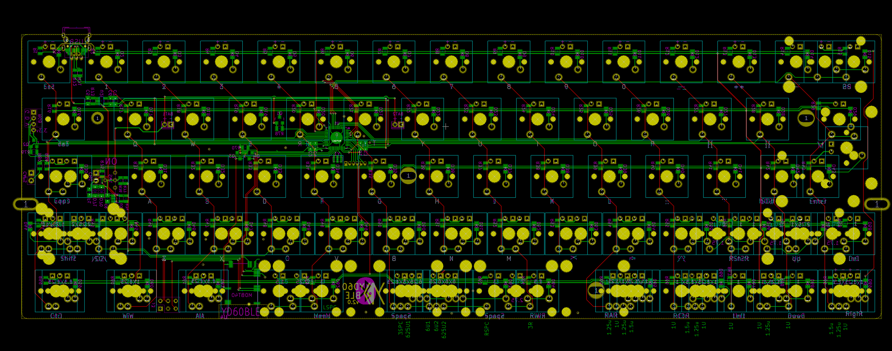

# YD60BLE / Just60

|Author |YANG |
|:--- |:--- |
|MCU|Atmel32u4|

## Hardware infomation

| COL | 0 | 1 | 2 | 3 | 4 | 5 | 6 | 7 | 8 | 9 | 10 | 11 | 12| 13 |
| --- |-|-|-|-|-|-|-|-|-|-|-|-|-|-|
| PIN | D6 | D7 | B4 | B6| B5 | B7 | F7 | F6 | F5 | F4 | F1 | F0 | E6 | B0 |

| ROW| 0 | 1 | 2 | 3 | 4 |
| --- |-|-|-|-|-|
| PIN | E2| C7 | B3 | B2 | B1 |

| Caps Lock LED | Backlight | WS2812 Data | WS2812 Power | Bluetooth Power |
| --- |-|-|-|-|
| D4 | C6| D0 | D1 | D5 |

PCB Pic for debug.

## 展示图

待补充

## 硬件版本区别
记录一下售出过的硬件版本的区别，方便以后其他人查看

**Just60 v1.0:**
> Just60算是基于YD60BLE的延伸，支持的配列有一些减少，也有一些增加。轴灯改为了下灯位，增加了RGB底灯。最大的变化还是默认的Bootloader换成了msd的，使用类似U盘的刷机方式了。

**YD60BLE v2.2:**
> 与2.0的区别是：PCB从白色沉金换成了黑色沉金；右Shift增加了兼容2u；电源部分稍微改进效率。还有少量的几张v2.2B版（黄PCB），区别就是它是下灯位的，支持的配列和功能都是一样的。v2.2版也是YD60BLE的最终版本。

**YD60BLE v2.0:**
> 与1.0的区别是：左Shift的2u钢丝在上方了（2.25u的还是在下方），同时左Shift恢复支持1.25+1；右Shift支持1+1.75；空格增加支持2.25+1+2.75；另外电源部分增加了保险丝。还有加入了对蓝牙的电源控制，所以在二级节能时，效果更佳，整体的续航也变长了。

**YD60BLE v1.0:**
> 第一个正式版本，白色沉金。左Shift的2u卫星轴，钢丝在下方。这一版左Shift不支持1.25+1，因为位置放错，成了支持1+1.25了。