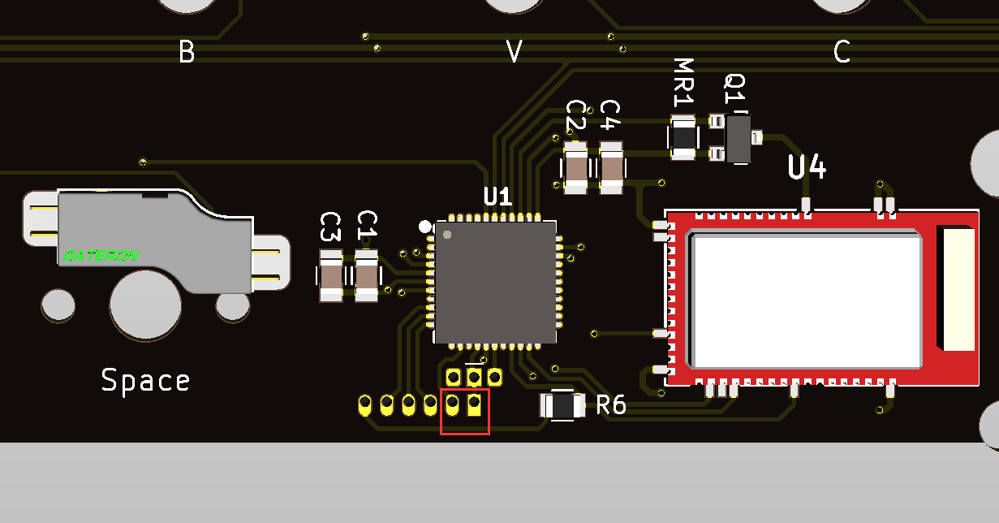

# YD67BLE

|Author??30% |YANG |
|:--- |:--- |
|MCU|Atmel32u4|
|BLE Module|MDBT40|

YD67BLE 是适配于 KBDFans KBD67 Lite 的双模PCB，不适配其他的外壳。

## 蓝牙配对

蓝牙配对主要参看，[BLE双模使用](ble-series.md)

简单说不需要单独启用配对模式，只要蓝牙处于未连接并且可发现状态，就可以配对。mac和ios的搜不到在上面文档里也有写处理方法，另外出现连接异常时，也有处理方法。

在每次电源状态变动（比如关掉开关重开，或者重新插入USB数据线）时，A与Capslock之间有一个指示灯会开始闪烁，一旦蓝牙已连接，灯条会变为绿色较慢闪烁，闪两三次后，自动熄灭。正常使用键盘时，也可以通过按 <kbd>LShift+RShift+S</kbd> 来查看蓝牙连接状态，指示方式同前面说的一样。

## 电池开关说明

因为它们的外壳都没有开关孔，所以电池开关使用了一个磁控的干簧管开关，都是位于Tab键的左边。

这个开关，当磁铁靠近它的时候，它就断开。没有磁铁靠近它的时候，它就一直是连通的。

一般来说，键盘让它一直通电正常使用就行。如果要放包里带着走，可以使用 Lock Mode 防止在包里碰到按键耗电。那么要用到它的时候，可能有如下情况：

  1. 键盘出错，比如按键都没反应了，并且左右Shift+S的时候，连接指示灯也不显示了。这时用磁铁靠近再拿开，键盘就断开然后重新通电，重启了。应该恢复正常。
  2. 刷错固件，导致键盘无法正常启动了。就用磁铁挨着开关，让开关处于断开。这时按Esc不放再插入数据线，这时移走磁铁，可以进入刷机模式重刷固件。
  3. 当然也可以将电池拔掉，以此来让键盘完全断电。

## 充电注意：
建议使用电脑的 USB 口来充电（如果使用充电器也使用那种仅支持5v的，比如苹果五福一安充电器）。

YD67BLE 的充电电流约为800ma，所以实际充满时间可以根据你使用的电池容量大致计算，充电的最后一段为娟流，所以会稍微增加一些时间。

另外，取消了充电指示灯。如果要了解充电状态，可以通过电量查看（系统显示的蓝牙电量或文字输出电量功能）。当显示为x1%（如31%，91%）这些值的时候，代表电池在充电;x0%时为未充电。

## 固件设置和更新

打开网址 https://ydkb.io ，选择好键盘 **YD67BLE**，然后页面上就有刷的方式[Mass Storage Device Bootloader（U盘模式）](bootloader/msd-bootloader)。按键编辑器的说明参看本文档的其他部分。

除了按住左上角键（一般是ESC）插线可以进入刷机模式，还可以使用 **灯光和增强功能** 里的 <kbd>Reset</kbd>，为了防止误按，需要先按住<kbd>LCtrl</kbd>, 再按这个<kbd>Reset</kbd>，可以直接跳到刷机模式，不用拔线再重插。

在更新到 2022-02-27 (DM2R) 之后的固件，还可以使用<kbd>LShift+RShift+LCtrl+B</kbd>直接进入刷机模式。

如果Esc按键本身也有问题了，还有特殊的短接的方式进入刷机模式。插上 USB 线，短接下图里红框中的两个点。

## 指示灯说明以及节能
正面LEDMAP的默认定义，如果要自己修改，请看[LEDMAP](features/ledmap)。

| 指示灯??30% | 默认配置 |
|:--- |:--- |
| Caps LED(默认黄灯) | CapsLock指示 |

> [!ydda] 蓝牙模式下指示灯使用注意
> - 在蓝牙模式下，Num Lock, Caps Lock, Scroll Lock这些指示灯，无法同步显示电脑的这三者状态。
> - 蓝牙模式下，实际是按一下按键就切换显示一次对应指示灯。只有在USB模式下是同步显示的。
> - 不同步时，可使用<kbd>Shift+对应按键</kbd>，如<kbd>Shift+Capslock</kbd>，这时CapsLock会生效但其指示灯不会变。
> - 合理利用这一点可在蓝牙下反转指示灯使用，如让numlock灯在亮时关，灭时开，可以省电。

除了LEDMAP定义的功能外，还有其他指示一些操作和状态。

| 状态或操作??30% | LED指示方式 |
|:--- |:--- |
| 刷机模式（空闲） | 指示灯闪烁，一直不灭 |
| 刷机模式（数据写入） | 在上面基础上，指示灯快速闪烁 |
| 启动时蓝牙 未连接 状态指示 | 指示灯闪烁（亮灭时间等长），如果一直未连接，约15秒左右会停止闪烁 |
| 启动时蓝牙 已连接 状态指示 | 指示灯较慢闪。每次亮的时间明显长于灭的时间。 |
| 按键 <kbd>LShift+RShift+S</kbd> | 按上面的方式指示蓝牙连接状态 |
| 从二级节能或 Lock Mode 唤醒 | 指示灯重新开始指示蓝牙连接状态 |
| 低电量提示 | 用键盘时，指示灯闪，但节能时不闪。依然还可以使用两三天。 |
| 极低电量提示 | 用键盘时，指示灯飞快闪烁，但节能时不闪。此时建议尽快充电。 |

> [!yddh] 提醒
> - 低电量提示的优先级最高，只要低电量时它会一直指示，同时覆盖其他的。

然后关于节能模式的说明：
  1. 键盘闲置3秒没按任何按键后，进入一级节能，此时每30ms再重新检查一次矩阵有无按键，有按键就退出一级节能，这个唤醒过程很快。
  2. 键盘如果90秒蓝牙未连接，或者闲置时间超过2.5小时，这时蓝牙会关闭并断开，进入二级节能。按任意键可以唤醒。
  3. 使用Lock Mode，会直接进入二级节能，与2的区别是，这个模式下，只能同时按F和J唤醒，不能按任意键唤醒。

二级节能的功耗是很低的，如果不是特别长期的不用，比如只是第二天不用，可以直接让键盘自己进入二级节能或者直接手动进入Lock Mode（后者更适合放包里，防止意外唤醒）

## 异常处理
如果出现按键错误触发或随机触发。请根据淘宝介绍提供的安装说明，确认一下电池和内部USB的母座，与键盘的电路板之间是否做好了绝缘。

工作时如果出现什么异常，最快速的方法是重新插一下usb线或是重新开关一下键盘电源开关。

以及请先参看 [BLE系列排错指南](ble-series/troubleshooting)。

遇到bug可以通过群里联系等方式报给我。
