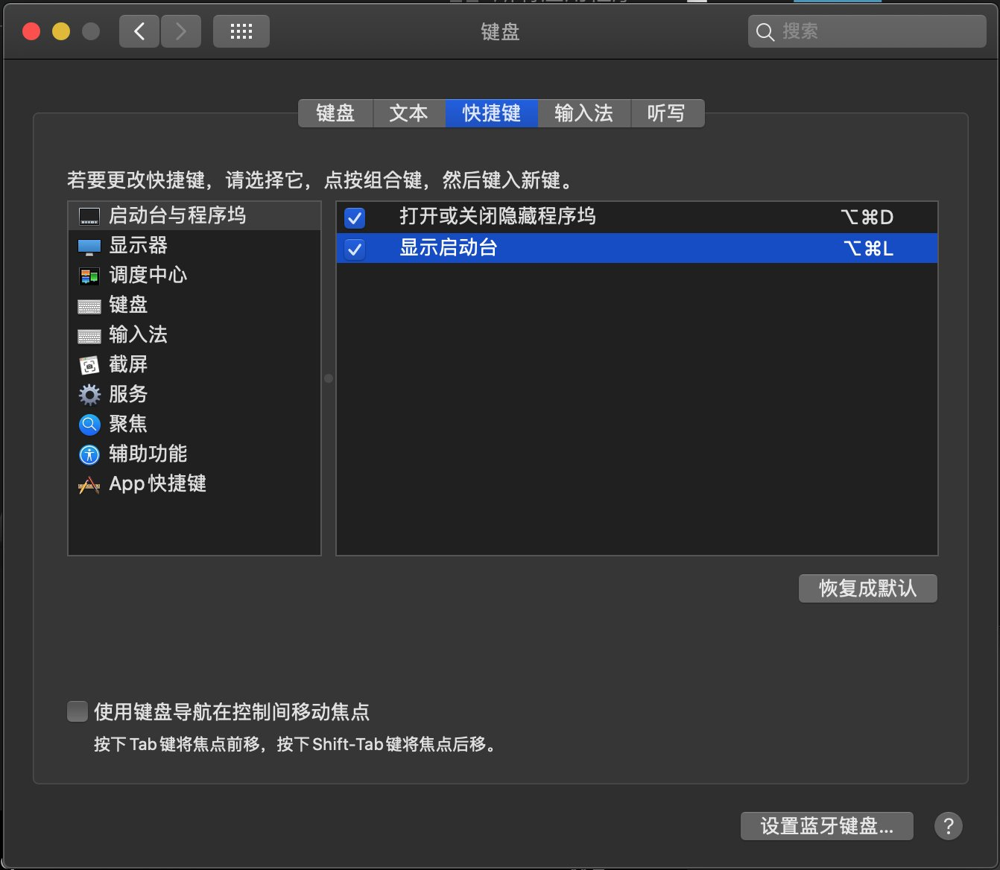
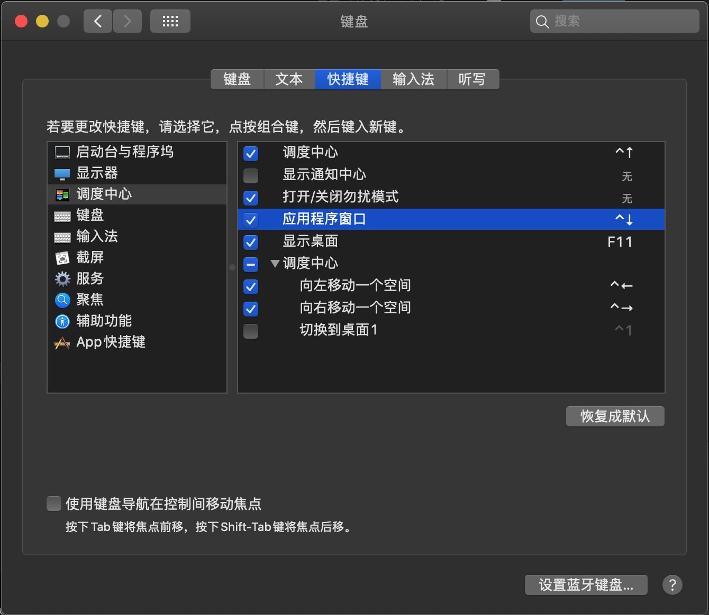

# Apple/Mac Keyboard Fn

苹果自家的键盘上有一个Fn按键，这个按键与非苹果键盘的Fn是不同的。

一般键盘的Fn，是键盘自身处理，比如Fn+F12是音量增大，那么按下Fn+F12时，键盘发送给系统的按键就是一个音量增大。而苹果键盘，Fn是也是一个普通的按键，按下Fn+F12的时候，键盘发送给系统的是Fn+F12，然后再由系统处理是音量增大这个功能。

tmk的wiki上有一点说明，见：https://github.com/tmk/tmk_keyboard/wiki/FAQ-Keymap#user-content-applemac-keyboard-fn

tmk上面提到的实现方法，qmk上也有人讨论过：https://github.com/qmk/qmk_firmware/issues/2179

总之，苹果的Fn是它第一方的一个特殊功能，目前看来第三方要实现只有类似hack成苹果第一方设备的方式，这会有一些潜在的风险，所以一般默认都不会提供支持。

## 换个思路实现

Mac是支持自定义快捷键的，对于苹果键盘来说，Fn+F4是启动台。而非苹果的键盘，没有这个功能，但是，可以在键盘，快捷键里，勾选这一项，并且为它指定一组快捷键。如下图，给它指示的快捷键是 **OPT+CMD+L**

然后按键盘上的 **OPT+CMD+L** 就能显示启动台了。当然，也可以设置为类似的Fn+F4的方式，方法就是在固件里Fn(层切换，具体设置的哪个层切换看你自己)对应的层里，把那里的F4设置为一个 [修饰键(组合键)](edit-keymap/mods-key)， 对应的按键就是 **OPT+CMD+L**。

不一定要设置到F4位置，你可以设置到键盘上的任意位置。

以上只是举了启动台这个例子，实际上Mac的快捷键设置好了，配合键盘的组合键，能实现的东西非常多。

