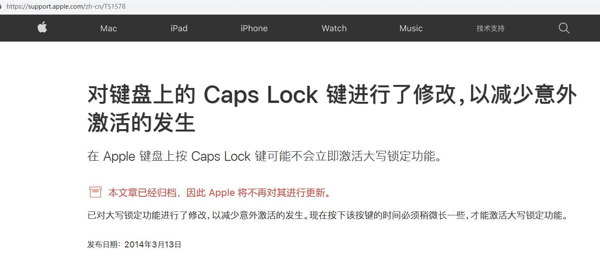

# Difference Between Apple and PC keyboards

url：http://xahlee.info/kbd/apple_pc_kb_diff.html

上面这一篇写得非常详了，有兴趣了解的可以看一下  

下面的这些则是YDKB总结出的部分区别。

## Capslock键
这个键在Mac和Win下的作用是一样的，但是应用时有区别。根据https://support.apple.com/zh-cn/TS1578 的说明，Mac下是需要稍微长按一下Capslock才有效的，而Win下只要按就触发。

因此，如果在固件里某个按键设置为 **按键 | 修饰键** 或 **按键 | 瞬时开启层** 的时候，因为这里的按键是瞬间触发的一下，按下和松开之间的间隔在1ms内，所以Mac判定为不触发。Mac下不建议将CapsLock设置为如上所的这种二合一功能。