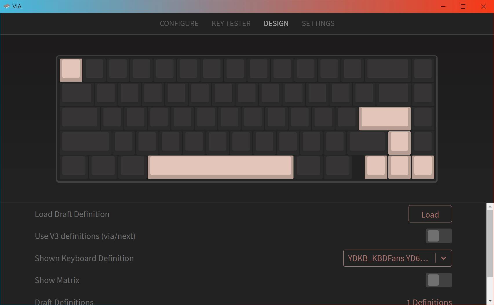
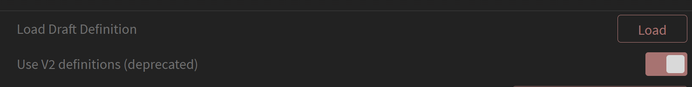

# VIA 固件更新
## 必要说明

本页提供为部分YDKB的键盘的VIA的固件，更新固件后，即可使用VIA。

为了方便区分固件版本，在插上USB的时候，支持VIA的固件后面为(VIA_Dxxx)，xxx是固件日期；而YDKB的是(USB_Dxxx)。不同系统下查看这个名称的方法如下：

VIA的固件功能，所以本帮助文档里面的大部分内容将无效。VIAl支持的功能，我本人也并不熟悉所有的，所有具体使用请查看VIA的相关帮助。我仅负责提供固件。

## 当前支持键盘的固件和json文件下载

测试期，目前还未提交合并到via官方。使用方法如下：

### 1 下载下表的支持VIA的固件并刷新到键盘

更新下表固件后，更新方法与ydkb.io一致。大部分使用 [Mass Storage Device Bootloader（U 盘模式)](bootloader/msd-bootloader.md)。

> [!ydda: 注意]
> - 更新固件可能导致之前的按键配置被重置为默认。
> - 建议固件更新前，先用 <u>SAVE+LOAD</u> 里的 <u>Save Current Layout</u>，保存当前按键设置到本地。更新完之后还可以再导入。

 

| 键盘 | 下载地址 | 补充说明 |
| ---- | ---- | --- |
| BLE660C/BLE980C | [VIA固件和JSON文件 (2022-04-28_DM4S)](other-firmware/via/ydkb_ble660c_980c_via.zip ':ignore') | LAYOUTS里选择660c或980c |
| HHKB BLE | [VIA固件和JSON文件 (2022-04-28_DM4S)](other-firmware/via/ydkb_hhkb_ble_via.zip ':ignore') | LAYOUTS里选择US/JP布局|
| Duang60 v1 | [VIA固件和JSON文件 (2022-06-29_DM6T)](other-firmware/via/ydkb_duang60v1_via.zip ':ignore') | |
| Duang60 v2 | [VIA固件和JSON文件 (2022-12-08_DMC8)](other-firmware/via/ydkb_duang60v2_via.zip ':ignore') | |
| Kunlun | [VIA固件和JSON文件(2022-11-09_DMB9)](other-firmware/via/ydkb_kunlun_via.zip ':ignore') | |
| Louise | [VIA固件和JSON文件(2022-06-29_DM6T)](other-firmware/via/ydkb_louise_via.zip ':ignore') | |
| Mountain | [VIA固件和JSON文件(2022-03-29_DM3T)](other-firmware/via/ydkb_mountain_via.zip ':ignore') | |
| YD67BLE | [VIA固件和JSON文件 (2022-12-08_DMC8)](other-firmware/via/ydkb_yd67ble_via.zip ':ignore') | |

### 2 连接VIA并导入JSON文件
USB连接时，可以从USB设备名称确认是否已经成功刷新支持VIA的固件。

VIA的本地软件下载见: https://github.com/the-via/releases/releases

它的使用可以参看官方网站： https://www.caniusevia.com/

如果是使用VIA 1.3.1版本，打开 VIA 时，请使用 `File - Import Keymap`， 导入在第1步下载的zip里面的JSON文件（文件名为 `键盘名_json_via`的那个。

之后就可以使用VIA设置按键了。

如果是高于VIA 2.0.4版本，或者是在线版[https://usevia.app/](https://usevia.app/)，请先在 `SETTINGS` 里打开 `Show Design Tab`，然后在 `DESIGN` 里，根据页面上的显示，选择关闭 `Use V3 definitions(via/next)`或者是开启`Use V2 definitios(deprecated)`，以确保它支持V2的json文件。这时再用 `Load` 载入json文件，或者把json文件直接拖到窗口的上传区域里。

 

## 额外说明

### 1 蓝牙功能按键
蓝牙的几个功能设置按键，也在CUSTOM里。除了自己设定按键，下面四个蓝牙要用到的主要功能，都有对应的<kbd>LShift+RShift+xx</kbd>快捷键 。

目前，VIA的固件相对于YDKB的固件，蓝牙功能有以下区别（未来可能还有变动）。

1. 因为无LEDMAP功能，所以蓝牙模式下，大小写指示灯不工作。但它仍然可以指示蓝牙连接状态及低电量等。
2. 不支持使用YDKB Tool修改蓝牙名称。但是可以使用YDKB的固件先修改好，再刷到VIA的固件。
3. 不支持蓝牙设备之间的切换，支持蓝牙与USB之间的切换。可以设置切换按键，或者使用<kbd>LShift+RShift+U</kbd>
4. 不支持<kbd>LShift+RShift+W</kbd>和<kbd>LCtrl+LShift+RShift+W</kbd>来进行开启或关闭蓝牙功能。
5. 支持Lock Mode，并且增加了Lock Mode的快捷键 <kbd>LShift+RShift+L</kbd>。

如果在使用蓝牙过程中遇到连接等问题，依然可以根据 [BLE系列排错指南](ble-series/troubleshooting.md) 来解决。

### 2 RGB控制按键
RGB的控制与qmk有所区别，本页的固件，RGB的控制说明参考 [rgblight](features/rgblight.md)。  

在VIA中设置时，使用的是CUSTOM中的几个按键来控制

