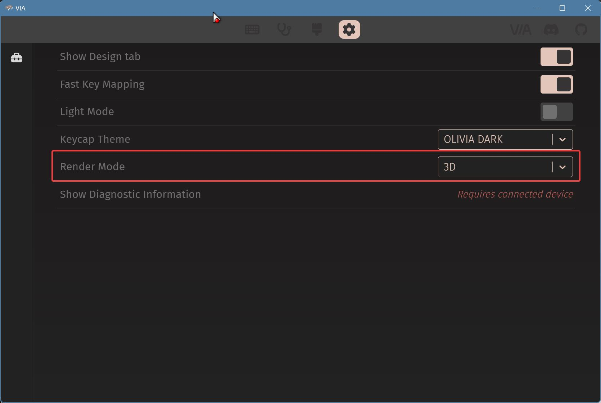
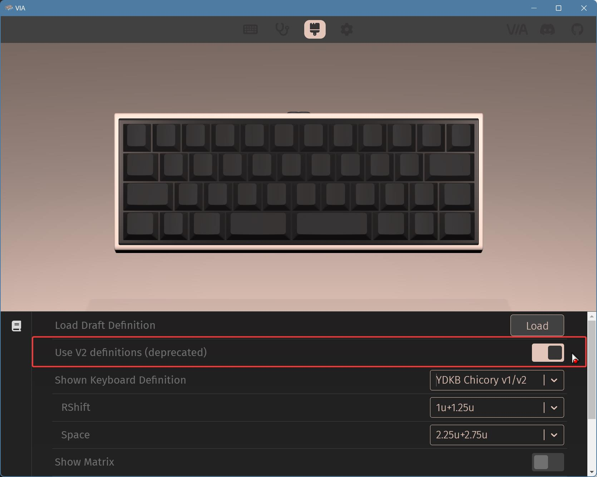
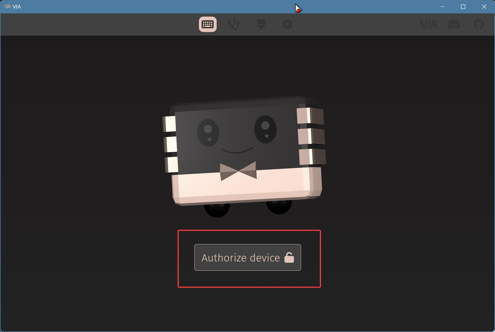
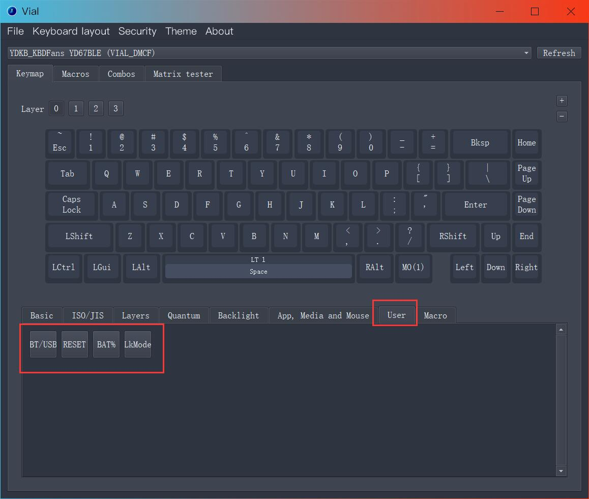
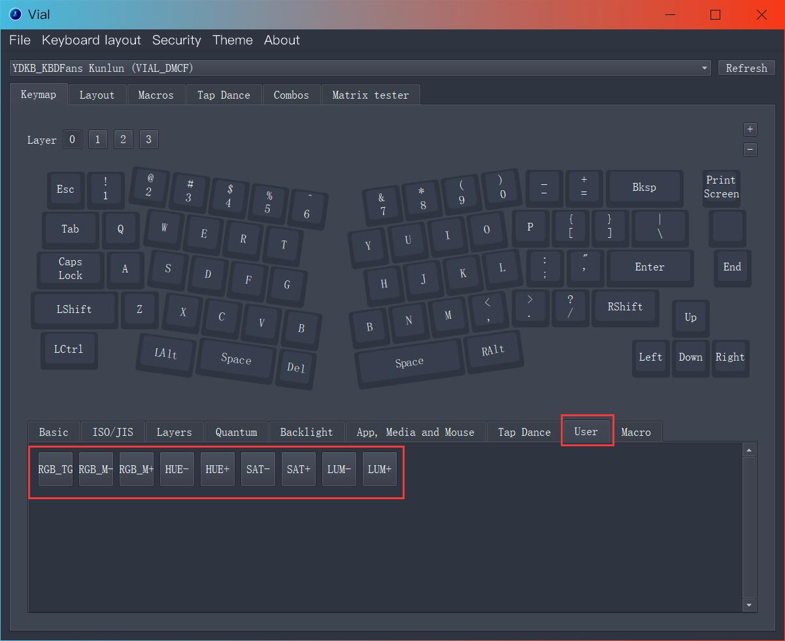
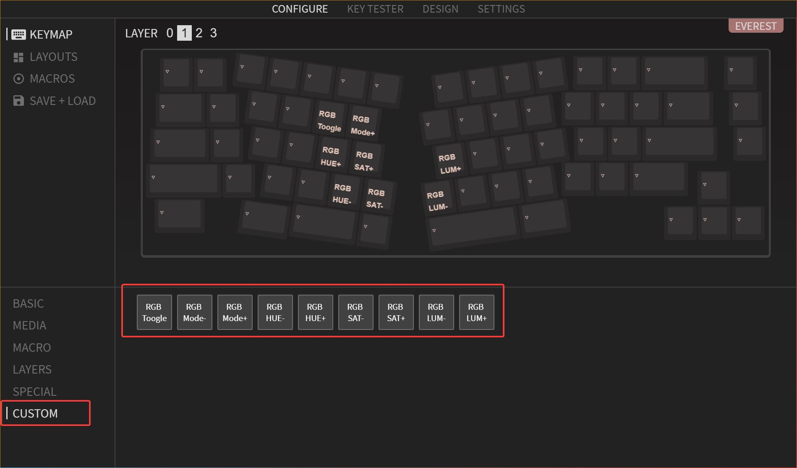

# VIA / Vial 固件更新
## 必要说明

本页提供为部分YDKB的键盘的Vial的固件，更新固件后，即可使用Vial的功能和修改按键。

同时这个固件也是支持VIA的，请参考下文的说明在VIA里导入JSON文件后，VIA就可识别并连接键盘。

为了方便区分固件版本，在插上USB的时候，USB设备名称，支持 VIA / Vial 的固件后面为(VIAL_Dxxx)，xxx是固件日期；而YDKB的是(USB_Dxxx)。

Vial的固件功能请参考Vial和qmk的相关文档，有些细节功能与ydkb.io的固件不同。Vial支持的功能众多，我本人也并不熟悉所有的，所有具体使用请查看Vial的相关帮助。

如果遇到bug可加 YDKB QQ ②群“767441859”联系我，我尽量解决。

需要源代码的，可访问: https://github.com/yangdigi/vial-qmk-v5/tree/ava/keyboards/ydkb

## 2025的一点新说明

本页提供的vial固件，会陆续开始支持使用 https://ydkb.io/ava 连接和设置按键。

AVA为代号Avalon的缩写，是一个新的用于设置 YDKB 键盘的在线驱动，基于qmk-vial，同时添加部分之前ydkb.io 固件的特色功能。

## 当前支持键盘的固件下载

### 1 下载下表的支持 VIA / Vial 的固件并刷新到键盘

如果你键盘里已经是支持 VIA / Vial 的固件（从USB设备名称可判断），如果版本与下表的一致，则可以不用重复更新。

下表的固件更新方法与ydkb.io一致。大部分使用 [Mass Storage Device Bootloader（U 盘模式)](bootloader/msd-bootloader.md)。

> [!ydda] 注意
> - 更新固件可能导致之前的按键配置被重置为默认。建议在更新固件前先保存备份一下按键设置到本地。
> - 如果是`Vial`，用 <u>File -> Save current layout</u> 保存当前按键设置到本地。更新后可以用 <u>File -> Load saved layout</u> 来导入先前保存的设置。注: Web版vial.rocks暂不支持保存和导入。
> - 如果是`VIA`，用 <u>SAVE+LOAD</u> 里的 <u>Save Current Layout</u>，保存当前按键设置到本地。更新后可以用此处的<u>Load saved layout</u> 再导入。

 

下载JSON文件请右键点击对应的JSON链接，选择 另存为。

| Eevee系列??25% | VIA / Vial 固件下载                                                           | VIA V2 JSON                                                       | 补充说明 |
| ------------ | ------------------------------------------------------------------------- | -------------------------------------------------------------- | ---- |
| Eevee \#EE60 | [2025-10-03_DPA3](other-firmware/vial/ydkb_eevee_ee60_vial.zip ':ignore') | [JSON](other-firmware/vial/ydkb_eevee_ee60_via.json ':ignore') |      |
| Eevee \#HFKB | [2025-10-03_DPA3](other-firmware/vial/ydkb_eevee_hfkb_vial.zip ':ignore') | [JSON](other-firmware/vial/ydkb_eevee_hfkb_via.json ':ignore') |      |
| Eevee \#HFKB_JP | [2025-10-03_DPA3](other-firmware/vial/ydkb_eevee_hfkb_jp_vial.zip ':ignore') | [JSON](other-firmware/vial/ydkb_eevee_hfkb_jp_via.json ':ignore') |      |
| Eevee \#EE660C | [2025-10-03_DPA3](other-firmware/vial/ydkb_eevee_ee660c_vial.zip ':ignore') | [JSON](other-firmware/vial/ydkb_eevee_ee660c_via.json ':ignore') |      |
| Eevee \#H60EC | [2025-10-03_DPA3](other-firmware/vial/ydkb_eevee_h60ec_vial.zip ':ignore') | [JSON](other-firmware/vial/ydkb_eevee_h60ec_via.json ':ignore') |      |
| Eevee \#40A  | [2025-10-03_DPA3](other-firmware/vial/ydkb_eevee_40a_vial.zip ':ignore')  | [JSON](other-firmware/vial/ydkb_eevee_40a_via.json ':ignore')  |      |
| Eevee \#40B  | [2025-10-03_DPA3](other-firmware/vial/ydkb_eevee_40b_vial.zip ':ignore')  | [JSON](other-firmware/vial/ydkb_eevee_40b_via.json ':ignore')  |      |
| Eevee \#EEPad_23U  | [2025-10-03_DPA3](other-firmware/vial/ydkb_eevee_eepad_23u_vial.zip ':ignore')  | [JSON](other-firmware/vial/ydkb_eevee_eepad_23u_via.json ':ignore')  |      |
| Eevee \#EE80U R1  | [2025-10-03_DPA3](other-firmware/vial/ydkb_ee80u_r1_vial.zip ':ignore')  | [JSON](other-firmware/vial/ydkb_ee80u_r1_via.json ':ignore')  |      |

| 键盘??25%            | VIA / Vial 固件下载                                                            | VIA V2 JSON                                                           | 补充说明                |
| ------------------ | ------------------------------------------------------------------------------------------------- | ------------------------------------------------------------------ | ------------------- |
| BLE660C/BLE980C    | [2025-10-03_DPA3](other-firmware/vial/ydkb_ble660c_980c_vial.zip ':ignore')   | [JSON](other-firmware/vial/ydkb_ble660c_980c_via.json ':ignore')   | LAYOUTS里选择660c或980c |
| HHKB BLE           | [2025-10-03_DPA3](other-firmware/vial/ydkb_hhkb_ble_vial.zip ':ignore')       | [JSON](other-firmware/vial/ydkb_hhkb_ble_via.json ':ignore')       | LAYOUTS里选择US/JP布局   |
| Chicory            | [2025-10-03_DPA3](other-firmware/vial/ydkb_chicory_vial.zip ':ignore')        | [JSON](other-firmware/vial/ydkb_chicory_via.json ':ignore')        |                     |
| Duang60 v1         | [2025-10-03_DPA3](other-firmware/vial/ydkb_duang60v1_vial.zip ':ignore')      | [JSON](other-firmware/vial/ydkb_duang60v1_via.json ':ignore')      |                     |
| Duang60 v2         | [2025-10-03_DPA3](other-firmware/vial/ydkb_duang60v2_vial.zip ':ignore')      | [JSON](other-firmware/vial/ydkb_duang60v2_via.json ':ignore')      |                     |
| Just68 v2          | [2025-10-03_DPA3](other-firmware/vial/ydkb_just68v2_vial.zip ':ignore')       | [JSON](other-firmware/vial/ydkb_just68v2_via.json ':ignore')       |                     |
| Louise             | [2025-10-03_DPA3](other-firmware/vial/ydkb_louise_vial.zip ':ignore')        | [JSON](other-firmware/vial/ydkb_louise_via.json ':ignore')         |                     |
| Minira v2          | [2025-10-03_DPA3](other-firmware/vial/ydkb_minira_v2_vial.zip ':ignore')      | [JSON](other-firmware/vial/ydkb_minira_v2_via.json ':ignore')      |                     |
| Pearly v1          | [2025-10-03_DPA3](other-firmware/vial/ydkb_pearly_v1_vial.zip ':ignore')      | [JSON](other-firmware/vial/ydkb_pearly_v1_via.json ':ignore')      |                     |
| Pearly v2          | [2025-10-03_DPA3](other-firmware/vial/ydkb_pearly_v2_vial.zip ':ignore')      | [JSON](other-firmware/vial/ydkb_pearly_v2_via.json ':ignore')      |                     |
| Xikii i6x          | [2024-06-22_DO6M](other-firmware/vial/ydkb_xikii_i6x_vial.zip ':ignore')      | [JSON](other-firmware/vial/ydkb_xikii_i6x_via.json ':ignore')      |                     |
| Xikii i8x          | [2024-06-22_DO6M](other-firmware/vial/ydkb_xikii_i8x_vial.zip ':ignore')      | [JSON](other-firmware/vial/ydkb_xikii_i8x_via.json ':ignore')      |                     |
| Xikii i104         | [2024-06-22_DO6M](other-firmware/vial/ydkb_xikii_i104_vial.zip ':ignore')     | [JSON](other-firmware/vial/ydkb_xikii_i104_via.json ':ignore')     |                     |
| Xikii Sasuke No.01 | [2022-12-22_DMCM](other-firmware/vial/ydkb_xikii_sasuke01_vial.zip ':ignore') | [JSON](other-firmware/vial/ydkb_xikii_sasuke01_via.json ':ignore') |                     |
| YDPM40BLE          | [2025-10-03_DPA3](other-firmware/vial/ydkb_ydpm40ble_vial.zip ':ignore')      | [JSON](other-firmware/vial/ydkb_ydpm40ble_via.json ':ignore')      |                     |
| Y80-11900          | [2025-07-17_DP7H](other-firmware/vial/ydkb_y80_11900_vial.zip ':ignore')      | [JSON](other-firmware/vial/ydkb_y80_11900_via.json ':ignore')      |                     |

| KBDFans 键盘??25%      | VIA / Vial 固件下载                                                                        | VIA V2 JSON                                                                    | 补充说明 |
| -------------------- | -------------------------------------------------------------------------------------- | --------------------------------------------------------------------------- | ---- |
| Agar                 | [2025-11-19_DPBJ](other-firmware/vial/ydkb_kbdfans_agar_vial.zip ':ignore')            | [JSON](other-firmware/vial/ydkb_kbdfans_agar_via.json ':ignore')            |      |
| Agar EC              | [2025-02-17_DP2H](other-firmware/vial/ydkb_kbdfans_agar_ec_vial.zip ':ignore')         | [JSON](other-firmware/vial/ydkb_kbdfans_agar_ec_via.json ':ignore')         |      |
| Agar Mini            | [2025-11-19_DPBJ](other-firmware/vial/ydkb_kbdfans_agar_mini_vial.zip ':ignore')         | [JSON](other-firmware/vial/ydkb_kbdfans_agar_mini_via.json ':ignore')         |      |
| Agar Mini EC         | [2025-09-28_DP9S](other-firmware/vial/ydkb_kbdfans_agar_mini_vial.zip ':ignore')         | [JSON](other-firmware/vial/ydkb_kbdfans_agar_mini_via.json ':ignore')         |      |
| Boomerang            | [2025-11-19_DPBJ](other-firmware/vial/ydkb_kbdfans_boomerang_vial.zip ':ignore')       | [JSON](other-firmware/vial/ydkb_kbdfans_boomerang_via.json ':ignore')       |      |
| Boop65               | [2024-11-25_DOBP](other-firmware/vial/ydkb_kbdfans_boop65_vial.zip ':ignore')          | [JSON](other-firmware/vial/ydkb_kbdfans_boop65_via.json ':ignore')          |      |
| Dusk67               | [2024-11-25_DOBP](other-firmware/vial/ydkb_kbdfans_dusk67_vial.zip ':ignore')          | [JSON](other-firmware/vial/ydkb_kbdfans_dusk67_via.json ':ignore')          |      |
| Eden v2              | [2024-11-25_DOBP](other-firmware/vial/ydkb_kbdfans_eden_v2_vial.zip ':ignore')         | [JSON](other-firmware/vial/ydkb_kbdfans_eden_v2_via.json ':ignore')         |      |
| KBD8x Mk3            | [2024-11-25_DOBP](other-firmware/vial/ydkb_kbdfans_kbd8xmk3_vial.zip ':ignore')        | [JSON](other-firmware/vial/ydkb_kbdfans_kbd8xmk3_via.json ':ignore')        |      |
| KBD8x Mk3 OG         | [2024-11-25_DOBP](other-firmware/vial/ydkb_kbdfans_kbd8xmk3_og_vial.zip ':ignore')     | [JSON](other-firmware/vial/ydkb_kbdfans_kbd8xmk3_og_via.json ':ignore')     |      |
| Kunlun               | [2023-07-15_DN7F](other-firmware/vial/ydkb_kunlun_vial.zip ':ignore')                  | [JSON](other-firmware/vial/ydkb_kunlun_via.json ':ignore')                  |      |
| Margo OG             | [2024-11-25_DOBP](other-firmware/vial/ydkb_kbdfans_margo_og_vial.zip ':ignore')                | [JSON](other-firmware/vial/ydkb_kbdfans_margo_og_via.json ':ignore')                |      |
| Mountain             | [2023-07-15_DN7F](other-firmware/vial/ydkb_mountain_vial.zip ':ignore')                | [JSON](other-firmware/vial/ydkb_mountain_via.json ':ignore')                |      |
| Onibi                | [2025-11-19_DPBJ](other-firmware/vial/ydkb_kbdfans_onibi_vial.zip ':ignore')           | [JSON](other-firmware/vial/ydkb_kbdfans_onibi_via.json ':ignore')            |      |
| PAVLOV               | [2024-06-23_DO6N](other-firmware/vial/ydkb_jolteon_pavlov_vial.zip ':ignore')          | [JSON](other-firmware/vial/ydkb_jolteon_pavlov_via.json ':ignore')          |      |
| Redux60RGB ANSI      | [2025-03-15_DP3F](other-firmware/vial/ydkb_kbdfans_redux60rgb_ansi_vial.zip ':ignore') | [JSON](other-firmware/vial/ydkb_kbdfans_redux60rgb_ansi_via.json ':ignore') |      |
| Taco(75%)            | [2024-11-25_DOBP](other-firmware/vial/ydkb_kbdfans_taco75_vial.zip ':ignore')          | [JSON](other-firmware/vial/ydkb_kbdfans_taco75_via.json ':ignore')          |      |
| Taco Pad             | [2024-11-25_DOBP](other-firmware/vial/ydkb_kbdfans_tacopad_vial.zip ':ignore')         | [JSON](other-firmware/vial/ydkb_kbdfans_tacopad_via.json ':ignore')         |      |
| Tofu-fa              | [2024-11-25_DOBP](other-firmware/vial/ydkb_kbdfans_tofufa_vial.zip ':ignore')          | [JSON](other-firmware/vial/ydkb_kbdfans_tofufa_via.json ':ignore')          |      |
| Tofu TKL 3.0         | [2025-11-19_DPBJ](other-firmware/vial/ydkb_kbdfans_tofu_tkl_3_0_vial.zip ':ignore')          | [JSON](other-firmware/vial/ydkb_kbdfans_tofu_tkl_3_0_via.json ':ignore')          |      |
| Uni88                | [2024-07-27_DO7R](other-firmware/vial/ydkb_kbdfans_uni88_vial.zip ':ignore')           | [JSON](other-firmware/vial/ydkb_kbdfans_uni88_via.json ':ignore')           |      |
| YD67BLE (KBD67 lite) | [2024-06-22_DO6M](other-firmware/vial/ydkb_yd67ble_vial.zip ':ignore')                 | [JSON](other-firmware/vial/ydkb_yd67ble_via.json ':ignore')                 |      |

| KBDFans 键盘??25%     | VIA / Vial 固件下载                                                                        | VIA V3 JSON                                                                    | 补充说明 |
| -------------------- | -------------------------------------------------------------------------------------- | --------------------------------------------------------------------------- | ---- |
| Athena1800           | [2025-08-22_DP8M](other-firmware/vial/kbdfans_athena1800_vial.zip ':ignore')            | [JSON](other-firmware/vial/kbdfans_athena1800_via_v3.json ':ignore')            |      |

> [!ydda] 使用Linux的用户注意
> - Linux下受限于一些权限问题，通过浏览器使用在线版，无法直接连接到键盘。
> - 个人建议Linux用户下载本地版的 VIA 或 Vial 运行使用。

### 2 连接Vial

Vial不需要单独的json文件，连上它的软件即可使用。

Vial的本地软件下载见: https://get.vial.today/download/ ，它的使用可以参看此文档的其他内容。

也可以使用在线版 https://vial.rocks/ ，如果没有科学上网载入速度可能较慢。

使用RP2040主控的键盘如Athena1800，单个固件为了同时兼容 AVA  / VIA / Vial，无法在线版本的Vial的，需要下载 https://github.com/yangdigi/vial-gui/releases/ 这里的桌面版本使用。该版本仅仅是增加了对 VIA PROTOCOL 12 的支持。

### 3 连接VIA

VIA的本地软件下载见: https://github.com/the-via/releases/releases

它的使用可以参看官方网站： https://www.caniusevia.com/

使用高于VIA 2.0.4版本，或者是在线版[https://usevia.app/](https://usevia.app/)，请先在 `SETTINGS` 里打开 `Show Design Tab`，后面还有可能需要将 `Render Mode` 设为 `3D`。

然后在 `DESIGN` 里，根据页面上的显示，选择`Use V2 definitios(deprecated)`，以确保它支持V2的json文件。如果下载的JSON文件名里包含了v3字样，那就不需要选中此选项。

再用 `Load` 载入json文件才能正常识别并载入。

最后是连接键盘，如果 `Render Mode` 为 `2D` 时显示有问题，就切换到 `3D`。点击下图这个图标再选择键盘连接。

## 额外说明

### 1 蓝牙功能按键
蓝牙的几个功能设置按键，在 Vial / VIA 中设置时，使用的是 User / CUSTOM 中的几个按键来控制。

除了自己设定按键，下面四个蓝牙要用到的主要功能，都有对应的<kbd>LShift+RShift+xx</kbd>快捷键 。

| 按键             | 功能              | 默认快捷键                      |
| -------------- | --------------- | -------------------------- |
| BT/USB         | 切换USB或蓝牙连接      | <kbd>LShift+RShift+U</kbd> |
| BLERST / RESET | 蓝牙重置时会用到        | <kbd>LShift+RShift+B</kbd> |
| BAT%           | 文字输出剩余电量        | <kbd>LShift+RShift+V</kbd> |
| LkMode         | 进入Lock Mode锁定节能 | <kbd>LShift+RShift+L</kbd> |

目前，本页固件的蓝牙功能与ydkb.io的固件有以下区别（未来可能还有变动）。

1. 因为无LEDMAP功能，所以蓝牙模式下，大小写指示灯不工作。但它仍然可以指示蓝牙连接状态及低电量等。
2. 不支持使用YDKB Tool修改蓝牙名称。但是可以使用YDKB的固件先修改好，再刷新Vial的固件。
3. 不支持蓝牙设备之间的切换，支持蓝牙与USB之间的切换。

如果在使用蓝牙过程中遇到连接等问题，依然可以根据 [BLE系列排错指南](ble-series/troubleshooting.md) 来解决。

### 2 RGB控制按键
RGB的控制与qmk有所区别，本页的部分固件，RGB的控制说明参考 [rgblight](features/rgblight.md)。  

在 Vial / VIA 中设置时，使用的是 User / CUSTOM 中的几个按键来控制。

> [!ydda] 如果  User / CUSTOM  内没有下图按键
> - 有一些键盘，在  User / CUSTOM 里没有RGB控制键，则是使用的 VIA / Vial 自带的按键控制。

其中控制 Mode(模式) / HUE(色相) / SAT(饱和度) / LUM(亮度) 的按键，不用加和减都设置。可以按住<kbd>Shift</kbd> + 相应的RGB控制键，进行反向操作。比如 <kbd>Shift</kbd>+<kbd>HUE++</kbd>作用就是 <kbd>HUE-</kbd>。

如果支持 RGB 但是在 User / CUSTOM 中没有以上按键的。那么可使用 Vial 的对应按键控制，如下图。

### 3 单色轴灯背光
使用 VIA / Vial 的背光控制按键即可。但是，不少键盘因为编译的固件尺寸偏大，未支持背光的呼吸模式，仅支持亮度调整。

### 4 Macro 宏
目前不支持直接在VIA里设置如{KC_XXX}这样的宏。如果要使用复杂的连续按键宏，请使用Vial设置。设置好后，在VIA里也可以选择使用，只是VIA里显示出来有些乱码。