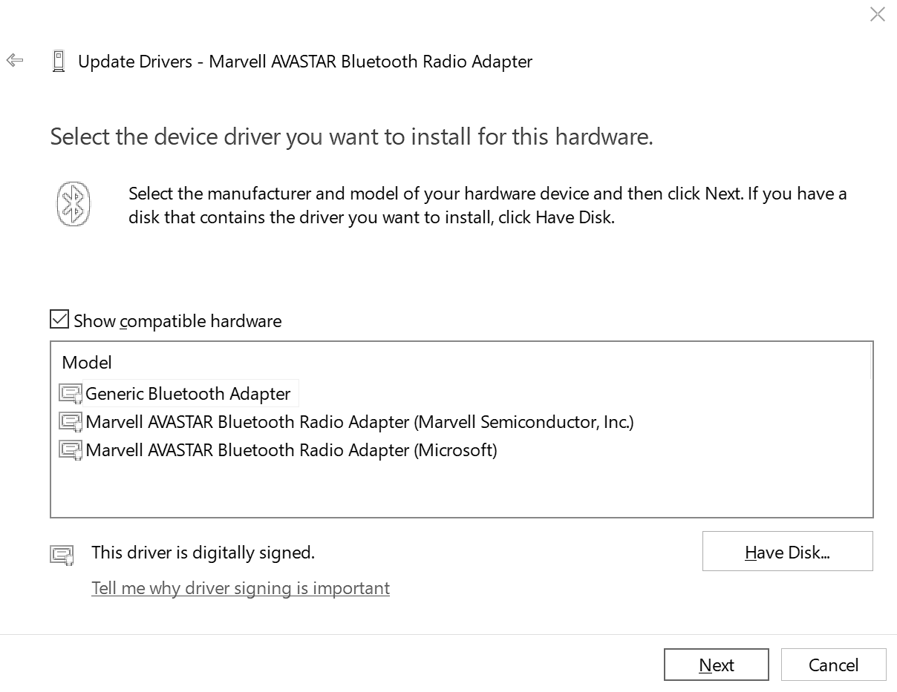
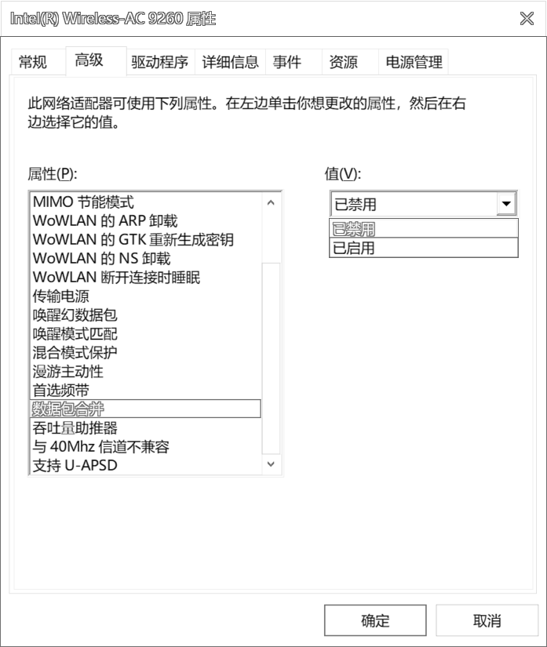

# 蓝牙键盘信号优化
虽然标题叫“蓝牙键盘信号优化”，但实际上很多工作都不是针对键盘本身而做的。因为键盘本身的大部分设置就没办法改的。

有很多人可能是第一次使用蓝牙键盘，还有蓝牙键盘甚至在不少人心里一直打上了不好用的标签。并不是所有蓝牙键盘都差的，同时有的体验差也不是只是键盘本身的原因。

因此，写了这篇，稍加说明，希望对想更好使用好蓝牙键盘的各位有所帮助。（暂时记录得有点乱，逐步整理）

## 硬件优化

接收器。

对于大部分笔记本内置了蓝牙来说，这部分已经不可变更。

台式机有的主板有自带wifi与蓝牙的模块，或者说可以自己安装的。即使不使用wifi，只使用蓝牙，也必须将它的外置天线装上。如果不装，蓝牙信号也是极差极差约等于不能用的。

蓝牙接收器或者天线，对于金属外壳的键盘，尽可能的位于它信号没有阻挡的一面。比如有不少的全金属外壳的键盘，是靠定位板一面出蓝牙信号的，那么蓝牙接收器或天线在键盘平面的上方，效果会稍好。

> [!yddh] 使用USB的蓝牙接收器，应当避免如下情况
> - 尽管USB蓝牙接收器未使用USB3.0，但是有的USB3.0物理接口屏蔽做得比较好，插在上面会影响无线信号。这时，可以换个接口，或者用2.0的延长线再插。此条对某些小巧的2.4G接收器同样适用。
> - 不要在蓝牙接收器的旁边，还有其他的USB无线网卡或者USB3.0的设备，那样也会有干扰。

最后还有一个共通的建议，在蓝牙天线（或接收器）与蓝牙键盘之间，尽量不要有强干扰的设备，比如其他的无线设备或者大的数据量传输线或者大电流的线。

除了接收器外，还有就是使用环境。离自己最近的这块区域，如果电脑要使用wifi，能用5GHz的wifi就尽量使用.

## 软件优化

蓝牙不像专用2.4G接收器的无线设备。它除了硬件配对外，还需要软件驱动来管理。

系统使用过程中，有时蓝牙出现问题，也不一定就是键盘这端的原因，可能是系统的驱动抽风了，可以尝试在系统里关闭蓝牙，然后再打开，等键盘重新连接之后，再试一下。

有一部分蓝牙模块，可能官方提供的驱动并不好用。可以尝试使用微软Windows自带的驱动，比如我的Surface Pro3的Marvell的网卡就是个例子，可以手动给蓝牙的驱动指定为win10自带的通用蓝牙驱动（下图第一项）。大部分Intel无线网卡自带的蓝牙，直接使用Intel的最新蓝牙驱动。

蓝牙也是属于2.4G的无线，想要最好的利用它，尽可能的。
  1. 减少其他2.4G的持续干扰，所以尽可能的自己的网络使用5GHz的wifi。
  2. 减少键盘到蓝牙接收器的阻挡和干扰。蓝牙接收器到键盘之间或者蓝牙接收器旁边有高速通信的USB3.0设备，也会有较大影响。
  3. 如果本来用着挺好然后信号开始变不好的，重新开关一下电脑的蓝牙，让它重连一次或几次，有时会有改善。（因为换到了一个干扰少的频道）
  4. 有的蓝牙wifi一体的模块，可能还需要如下的项目设置为禁用，或者类似的设置。
  5. 有的系统或硬件下，使用时出现偶尔断开或响应慢的问题，尝试不要勾选 "允许计算机关闭此设备以节约电源"。

